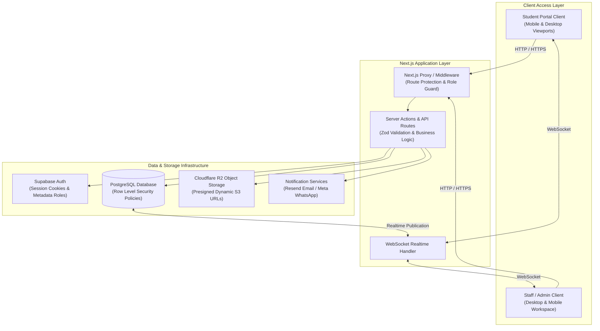

# International Student Compliance Management System (ISCMS)

### ISCMS — Centralized International Student Compliance Management Platform

A modern, enterprise-grade web platform engineered for higher-education institutions, universities, and international student offices to centralize international student record management, compliance document verification, expiration monitoring, automated alert workflows, operational reporting, and administrative governance.

[](https://nextjs.org)
[](https://react.dev)
[](https://www.typescriptlang.org)
[](https://tailwindcss.com)
[](https://supabase.com)
[](https://www.cloudflare.com/developer-platform/r2/)

**Application Type:** Reusable Multi-Tenant Web Application  
**Deployment Target:** Production Institutional / Organizational Deployment  
**Product Status:** Production-Ready Web Application  

---

## 1. Product Overview

The **International Student Compliance Management System (ISCMS)** is a software platform designed to assist universities and educational organizations in managing foreign student records and maintaining continuous regulatory compliance.

Managing international student administration involves critical immigration requirements, including passport validity, student visa statuses, and institutional compliance registrations (such as eFRRO). Manual tracking through disparate spreadsheets or legacy databases introduces operational risks, such as overlooked expiration dates, delayed document renewals, and regulatory non-compliance.

ISCMS centralizes the complete international student compliance lifecycle into two distinct, role-isolated operational environments:

### Administrative Workspace (`/dashboard`, `/students`, `/notifications`, `/reports`, `/settings`)
Used by authorized university administrators, international student advisors, and compliance officers to manage student registries, review submitted compliance documents, conduct document verifications, monitor expiration timelines, generate compliance reports, and configure institutional settings.

### Student Portal (`/student/dashboard`, `/student/notifications`, `/student/efrro`, `/student/settings`)
Used by enrolled international students to view their real-time compliance status, upload required passport, visa, and registration document copies, receive account notifications, and manage portal preferences through passwordless authentication.

---

## 2. Core Product Capabilities

### Student Registry & Profile Management
* **Centralized Student Registry**: Comprehensive digital registry for tracking international students across departments, campuses, and academic programs.
* **Structured Student Profiles**: Tracks essential record fields, including passport numbers, visa details, registration IDs, contact details, home country addresses, and enrollment status.
* **Instant Search & Filter**: Real-time filtering by student name, registration ID, nationality, academic program, or compliance standing.

### Compliance Document Management
* **Multi-Document Verification**: Dedicated inspection workflows for key compliance documents, including **Passports**, **Visas**, and **eFRRO / Registration Permits**.
* **Status Lifecycle Tracking**: Automated document status states (`Pending Verification`, `Approved`, `Rejected`, `Expired`).
* **Document Audit Trails**: Maintains historical records of document submission dates, inspection comments, and verification decisions.
* **Secure Storage Integration**: Direct integration with private object storage (Cloudflare R2 / Supabase Storage) using short-lived, presigned URL access tokens.

### Expiration & Compliance Monitoring
* **Automated Expiration Engine**: Continuous evaluation of student document expiration dates against institutional compliance thresholds.
* **Compliance Classifications**: Evaluates real-time compliance standing (`Compliant`, `Expiring Soon`, `Expired`, `Missing Documents`).
* **Visual Expiry Timelines**: Color-coded badges, status indicators, and countdown timelines for upcoming passport, visa, and registration renewals.

### Unified Notification Architecture
* **Role-Aware Notification Center**: Centralized Notification Center (`/notifications` for staff, `/student/notifications` for students) featuring category filtering, search, priority levels, and unread badges.
* **Realtime WebSocket Synchronization**: Live notification dispatch and unread count badge updates powered by Supabase Realtime WebSockets.
* **Multi-Channel Delivery Support**: Architecture support for in-app alerts, institutional email (Resend API), and WhatsApp direct messaging (Meta Business API).

### Operational Reporting & Analytics
* **Executive Dashboard**: Visual metric cards displaying active student totals, pending document verifications, upcoming expirations, and system health status.
* **Specialized Compliance Reports**: Dedicated report views for Student Registry, eFRRO Expirations, Audit Logs, and Notification Delivery status.
* **System Health Diagnostics**: Status diagnostics for database connectivity, storage API readiness, and background services.

### Administrative Governance & System Controls
* **Initial Setup Wizard**: Guided system initialization workflow (`/setup`) for fresh database provisioning and initial administrator creation.
* **Emergency Administrator Recovery**: Secure recovery mechanism allowing system restoration if administrator access requires resetting.
* **System Audit Logging**: Comprehensive system log recording login events, verification decisions, administrative changes, and document uploads.

---

## 3. User Roles & Access Hierarchy

ISCMS enforces a strict, server-verified role and authorization hierarchy:

| Role | Workspace Access | Primary Responsibilities & Permissions |
|---|---|---|
| **Administrator** | Administrative Workspace (`/*`) | Privileged operational control. Manages staff user accounts, executes system setup/recovery, configures retention policies, manages global settings, oversees all student records, conducts document verifications, and exports reports. |
| **Staff** | Administrative Workspace (`/*`) | Authorized compliance staff and advisors. Manages student profiles, conducts document inspections (approve/reject), triggers reminder notifications, and views compliance reports. Cannot alter global system settings or execute setup recovery. |
| **Student** | Student Portal (`/student/*`) | Restricted student portal. Authenticated via passwordless OTP. Views personal compliance standing, uploads passport/visa/registration document copies, receives student alerts, and adjusts portal theme settings. **Strictly isolated from administrative data.** |

---

## 4. Student Portal Experience

The Student Portal (`/student`) provides international students with a responsive, accessible interface optimized for desktop, tablet, and mobile viewports:

```text
                        Student Portal Operational Lifecycle
                                         │
                  ┌──────────────────────┴──────────────────────┐
                  │                                             │
       Passwordless Authentication                      Student Dashboard
       (WhatsApp / Email OTP)                          (Status Summary)
                  │                                             │
                  ├─────────────────────────────────────────────┤
                  │                                             │
         Document Centre                              Student Notifications
         (Passport / Visa / eFRRO Upload)             (/student/notifications)
```

* **Passwordless OTP Login**: Students authenticate securely using single-use OTP codes dispatched via WhatsApp or email.
* **Compliance Overview**: High-level status cards displaying active validity for Passport, Visa, and eFRRO / Registration permits.
* **Document Centre (`/student/efrro`)**: Document submission interface supporting file validation (PDF, JPEG, PNG, max 10MB) and progress indicators.
* **Submission History (`/student/history`)**: Activity timeline showing historical verification approvals, rejections, and submission timestamps.
* **Student Notification Center (`/student/notifications`)**: Dedicated workspace displaying account-specific compliance alerts and document approval notices.
* **Light / Dark Mode**: Integrated theme toggle (`ThemeToggle`) supporting instant light and dark theme switching.

---

## 5. Administrative Workspace

The Administrative Workspace (`/dashboard`) equips international student advisors and compliance officers with operational tools:

* **Dashboard (`/dashboard`)**: Operational dashboard featuring compliance breakdown charts, urgent document verification queues, and system health metrics.
* **Student Management (`/students`)**: Searchable tabular registry supporting pagination, nationality filters, program filters, and quick actions.
* **Student Registration (`/students/add`)**: Form wizard for onboarding new international students with field validation.
* **Document Inspection (`/students/[id]/passport`, `/visa`, `/efrro`)**: Detailed side-by-side document viewer, verification status toggle, and audit comment recorder.
* **Communication & Reminders (`/reminders`)**: Workspace for queuing and monitoring compliance alerts across email and messaging channels.
* **Operational Reports (`/reports`)**: Specialized compliance reporting interfaces with data export options (`/reports/students`, `/reports/efrro`, `/reports/audit`, `/reports/notifications`).
* **Settings & Governance (`/settings`)**: Multi-tab administration workspace for institutional details, document retention policies, user management, and security controls.

---

## 6. Document Compliance Lifecycle

The core operational workflow ensures seamless document submission, verification, and monitoring:

```text
  Student Registration (Staff or Admin Setup)
                   │
                   ▼
  Student Uploads Compliance Documents (Student Portal)
                   │
                   ▼
  Document Appears in Inspection Queue (Staff Dashboard)
                   │
                   ▼
  Staff Verifies Document (Approved / Rejected with Audit Comment)
                   │
                   ▼
  Compliance Engine Evaluates Expiration Date Continually
                   │
                   ▼
  Pre-Expiry Warning Triggered (e.g., 30 Days Before Expiry)
                   │
                   ▼
  Automated Reminder Dispatched (In-App + Email / Messaging)
                   │
                   ▼
  Student Re-uploads Updated Document
```

---

## 7. Technology Stack

ISCMS is built using modern, production-grade web technologies:

| Layer | Technology | Specification / Version |
|---|---|---|
| **Framework** | Next.js (App Router, Turbopack) | `v16.2.10` |
| **Frontend UI** | React | `v19.2.4` |
| **Language** | TypeScript (Strict Mode) | `v5.x` |
| **Styling** | Tailwind CSS / tw-animate-css | `v4.x` |
| **UI Components** | shadcn/ui / Base UI / Lucide Icons | Latest |
| **Database** | PostgreSQL (Supabase DB) | PostgreSQL 15+ |
| **Authentication** | Supabase Auth (Cookie-based Sessions) | `@supabase/ssr v0.12.3` |
| **Object Storage** | Cloudflare R2 / Supabase Storage | `@aws-sdk/client-s3 v3.1098.0` |
| **State & Fetching** | TanStack React Query | `v5.101.2` |
| **Realtime Engine** | Supabase Realtime WebSockets | `@supabase/supabase-js v2.110.1` |
| **Form Validation** | React Hook Form + Zod | `zod v4.4.3` |
| **Theme Management** | next-themes | `v0.4.6` |
| **Monitoring** | Sentry Next.js SDK | `v10.68.0` |

---

## 8. System Architecture



---

## 9. Security Architecture & Controls

ISCMS enforces defense-in-depth security mechanisms:

* **Server-Side Permission Enforcement**: Every route and Server Action verifies user identity and role server-side. Frontend UI hiding is never relied upon as a primary security control.
* **Row Level Security (RLS)**: PostgreSQL tables feature RLS policies (`SELECT_in_app_notifications_StudentSelf`, `SELECT_in_app_notifications_StaffAdmin`) ensuring students can only access records matching `user_id = auth.uid()`.
* **Cookie-Based Session Management**: Built on `@supabase/ssr` using HTTP-only, secure, same-site session cookies.
* **Private Object Storage**: Uploaded compliance PDFs and images are stored in private buckets. Access is mediated strictly via short-lived, presigned URL tokens.
* **Input & File Validation**: Server-side Zod validation schemas inspect file MIME types (`application/pdf`, `image/jpeg`, `image/png`) and file size limits (10MB max).
* **Audit Logging**: Administrative changes, verification approvals, rejections, and system recovery triggers are logged to system audit tables.
* **Security Headers & CSP**: Configured with strict Content Security Policy (CSP), X-Frame-Options, X-Content-Type-Options, and Referrer Policy headers.

---

## 10. System Initialization & Emergency Recovery

### Fresh System Initialization (`/setup`)
When ISCMS is deployed against a new database, the application automatically detects the uninitialized state and directs administrators to the **Initial Setup Wizard** (`/setup`).

```text
  Fresh Deployment / Clean Database
                 │
                 ▼
  System State Guard Detects No Admin Account
                 │
                 ▼
  Redirects to Initial Setup Wizard (/setup)
                 │
                 ▼
  Step 1: System Health & Database Connection Check
  Step 2: Provision Primary Administrator Credentials
  Step 3: Configure Institutional Details & Branding
  Step 4: Execute Initial Schema Seed & Initialize State
                 │
                 ▼
  Redirects to Administrative Workspace (/dashboard)
```

### Emergency Administrator Recovery Mode (`/setup`)
If administrative access is lost or emergency recovery is required, ISCMS features a secure **Administrator Recovery Mode**:
* Accessible via `/setup` when recovery parameters are satisfied.
* Allows restoring primary administrator credentials without resetting existing student compliance records.
* Logs the emergency recovery action to the audit trail for security accountability.

---

## 11. Project Structure

```text
International-Student-Compliance-Management-System/
├── docs/                        # Architecture decision records, plans & walkthroughs
├── documentation/               # Detailed QA matrices, security reports & architecture specs
├── public/                      # Static assets & favicons
├── src/
│   ├── app/                     # Next.js App Router structure
│   │   ├── (app)/               # Staff/Admin Workspace routes (/dashboard, /students, etc.)
│   │   │   ├── dashboard/       # Executive dashboard & system health (/dashboard/health)
│   │   │   ├── notifications/   # Staff Notification Center (/notifications)
│   │   │   ├── reminders/       # Communication & reminder management
│   │   │   ├── reports/         # Compliance reporting routes
│   │   │   ├── settings/        # System administration settings
│   │   │   └── students/        # Student management & document inspection routes
│   │   ├── api/                 # Server API endpoints & webhooks (/api/webhooks/meta, etc.)
│   │   ├── student/             # Student Portal routes (/student/dashboard, /student/notifications)
│   │   │   ├── (authenticated)/ # Passwordless authenticated student views
│   │   │   └── (public)/        # Student OTP login route
│   │   ├── setup/               # System Initial Setup Wizard & Recovery Mode
│   │   └── layout.tsx           # Global application root layout & providers
│   ├── components/              # Reusable React components
│   │   ├── header/              # Breadcrumbs, header bell, theme toggle, search
│   │   ├── notifications/       # Shared NotificationCenterWorkspace & list items
│   │   ├── settings/            # Settings tab workspaces
│   │   ├── shell/               # Administrative app shell container
│   │   └── ui/                  # shadcn/ui design system primitives
│   ├── config/                  # Institutional branding, environment & route maps
│   ├── domain/                  # Core domain logic, models, storage & notification providers
│   ├── features/                # Feature-specific modules & UI elements
│   ├── hooks/                   # Custom hooks (useNotificationCenter, useRealtime, etc.)
│   ├── lib/                     # Supabase clients (browser, server, admin) & utilities
│   ├── providers/               # React Query, Theme, & Realtime context providers
│   ├── services/                # Legacy domain services & audit logger
│   └── middleware.ts            # Proxy middleware for authentication & role protection
├── supabase/
│   ├── migrations/              # SQL schema migration files (001 through 029)
│   └── seed/                    # Reference dataset seed files
├── .env.local.example           # Environment variables configuration template
├── next.config.js               # Next.js configuration & security headers
├── package.json                 # Project dependencies & scripts
└── README.md                    # Institutional product documentation
```

---

## 12. Local Development Guide

### Prerequisites
* **Node.js**: `v20.x` or higher
* **Package Manager**: `npm` (v10+)
* **Supabase Instance**: A Supabase PostgreSQL project with Auth enabled

### Installation

1. **Clone the repository**:
   ```bash
   git clone https://github.com/saarthvadalia26/International-Student-Compliance-Management-System.git
   cd International-Student-Compliance-Management-System
   ```

2. **Install dependencies**:
   ```bash
   npm install
   ```

3. **Configure Environment Variables**:
   Create a `.env.local` file at the root of the project by copying the provided example template:

   ```bash
   cp .env.local.example .env.local
   ```

   Fill in the required configuration parameters:

   ```env
   # -----------------------------------------------------------------------------
   # Public Supabase Configuration
   # -----------------------------------------------------------------------------
   NEXT_PUBLIC_SUPABASE_URL=https://your-project-id.supabase.co
   NEXT_PUBLIC_SUPABASE_ANON_KEY=your-supabase-anon-key

   # -----------------------------------------------------------------------------
   # Private Server Credentials (NEVER expose to client)
   # -----------------------------------------------------------------------------
   SUPABASE_SERVICE_ROLE_KEY=your-supabase-service-role-key
   SUPABASE_JWT_SECRET=your-supabase-jwt-secret

   # -----------------------------------------------------------------------------
   # Object Storage Provider ("cloudflare-r2" or "supabase")
   # -----------------------------------------------------------------------------
   STORAGE_PROVIDER=cloudflare-r2
   R2_ACCOUNT_ID=your-cloudflare-account-id
   R2_ACCESS_KEY_ID=your-r2-access-key-id
   R2_SECRET_ACCESS_KEY=your-r2-secret-access-key

   # -----------------------------------------------------------------------------
   # Email & WhatsApp Gateway Configuration
   # -----------------------------------------------------------------------------
   EMAIL_PROVIDER=resend
   RESEND_API_KEY=your-resend-api-key
   RESEND_FROM_EMAIL=compliance@your-institution.edu

   WHATSAPP_PROVIDER=meta
   META_ACCESS_TOKEN=your-meta-access-token
   META_PHONE_NUMBER_ID=your-meta-phone-number-id
   META_APP_SECRET=your-meta-app-secret
   META_WEBHOOK_VERIFY_TOKEN=your-meta-webhook-verify-token

   # -----------------------------------------------------------------------------
   # System Automation & Security Secrets
   # -----------------------------------------------------------------------------
   CRON_SECRET=your-cron-execution-secret
   ```

4. **Apply Database Migrations**:
   Execute the SQL files in `supabase/migrations/` (001 through 029) in sequential order in your Supabase SQL Editor to provision tables, indexes, triggers, and Row Level Security policies.

5. **Start the Development Server**:
   ```bash
   npm run dev
   ```

   Access the application at [http://localhost:3000](http://localhost:3000).

---

## 13. Production Verification & Build Pipeline

Before committing changes or deploying to production, execute the standard verification pipeline:

```bash
# 1. Run ESLint code checks
npm run lint

# 2. Run TypeScript strict type verification
npx tsc --noEmit

# 3. Execute Next.js production build
npm run build
```

---

## 14. Deployment Architecture

ISCMS is designed for deployment on **Vercel** or containerized Node.js environments connected to **Supabase Cloud / Managed PostgreSQL** and **Cloudflare R2 Object Storage**.

```text
  GitHub Repository / Source Pipeline
                 │
                 ▼
  Production Deployment Pipeline (Vercel / Node.js Host)
                 │
                 ▼
  Next.js Production Bundle (Edge Proxy + Serverless Functions)
                 │
  ┌──────────────┼──────────────┬──────────────┐
  │              │              │              │
  ▼              ▼              ▼              ▼
Supabase DB   Supabase Auth  Cloudflare R2   Notification APIs
(PostgreSQL)  (Sessions)     (S3 Storage)   (Resend / Meta)
```

---

## 15. File & Document Management

* **Supported Document Types**: **Passport**, **Visa**, and **eFRRO / Registration Permit** documents.
* **Allowed MIME Formats**: `application/pdf`, `image/jpeg`, `image/png`.
* **Maximum File Size**: 10MB per file.
* **Storage Provider Engine**: Supports Cloudflare R2 (S3-compatible API) or native Supabase Storage buckets.
* **Access Control**: Uploaded files are private. Client components request presigned S3 URLs generated server-side with strict 15-minute expiration bounds.

---

## 16. Accessibility & UX Standards

* **Responsive Layouts**: Tested across Mobile (`320px - 414px`), Tablet (`768px`), and Desktop (`1024px+`) viewports. Zero horizontal scroll overflow on mobile cards or filter bars.
* **Theme Support**: Native Light Mode and Dark Mode support with system theme detection via `next-themes`.
* **Keyboard Accessibility**: Visible focus rings (`focus:ring-2 focus:ring-primary/20`), proper HTML button elements, and `aria-label` attributes on interactive elements.
* **WCAG 2.1 Color Contrast**: High-contrast typography against light and dark card backgrounds.

---

## 17. Operational Considerations

* **Database Backups**: Automated daily PostgreSQL snapshots managed via Supabase Cloud.
* **Document Retention Policy**: Automated cleanup service (`/api/cron/retention-cleanup`) evaluating document retention rules based on institutional settings.
* **Audit Trail Records**: System-wide audit logs available for inspection under `/reports/audit`.
* **System Diagnostics**: Health status dashboard available at `/dashboard/health` for monitoring memory, storage, and database connection pools.

---

## 18. Data Privacy & Confidentiality Notice

ISCMS processes sensitive institutional and personal data belonging to international students, including passport identifiers, immigration documents, residential addresses, and academic records.

* **Credentials Protection**: API keys, service role tokens, and database passwords must **NEVER** be committed to source control repositories.
* **Institutional Governance**: Organizations deploying ISCMS are responsible for configuring and operating the system in accordance with their applicable institutional privacy policies, data protection frameworks, and legal obligations.

---

## 19. Ownership & Licensing

This section provides a high-level overview of the software ownership, licensing framework, and data governance model applicable to the International Student Compliance Management System (ISCMS). Specific rights and obligations are governed by the applicable written agreement.

```text
                     ISCMS Software Platform
                                │
          ┌─────────────────────┴─────────────────────┐
          │                                           │
  Proprietary Code & IP                    Institutional Data
  (Software Owner)                         (Customer Sovereignty)
          │                                           │
          │ Authorized Deployment Use                 │
          ▼                                           ▼
  Institutional Customer                  Institutional Operations
  (Deployed Instance)                     (Student & Compliance Records)
```

### 1. Software & Source Code Ownership
* **Developer Intellectual Property**: ISCMS, including its underlying source code, system architecture, component implementations, database schema design, UI/UX workflows, documentation, and associated software assets, remains the intellectual property of the developer/owner unless otherwise explicitly assigned or transferred through a separate written agreement.
* **Non-Transfer of Software Title**: Providing a customer or institution access to a deployed instance of ISCMS does not automatically transfer ownership of the underlying software or source code.

### 2. Customer & Institutional Usage Rights
* **Authorized Deployment Access**: Institutional customers receive licensed or otherwise authorized access to deployed instances of the ISCMS platform for their operational compliance management activities.
* **Operational Scope**: Authorized access to and use of a deployed ISCMS instance does not constitute a transfer of ownership of the underlying software codebase, architecture, or intellectual property.

### 3. Source Code Access Terms
* **Deployment Access**: Authorized institutional deployment grants access to the operational web application service. Access to the deployed system does not automatically include access to or transfer of the underlying source code.
* **Separate Agreement Required**: Any source-code access, transfer, assignment, modification rights, redistribution permissions, or sublicensing rights must be expressly established through a separate written agreement executed by the software owner.

### 4. Customer Data Sovereignty
* **Data Sovereignty**: A strict distinction is maintained between **software infrastructure ownership** and **customer data ownership**.
* **Customer Data Rights**: The software owner makes **no claim of ownership** over customer or institutional operational data, student profiles, uploaded document files, or administrative compliance records. All customer and institutional data remains subject to the applicable customer agreement, institutional policies, and applicable law.

### 5. No Open-Source License Grant
* **Proprietary Classification**: ISCMS is **proprietary software** and is **not** released under an open-source license (such as MIT, Apache 2.0, GPL, BSD, or ISC).
* **Repository Visibility**: Public or restricted availability of this repository (for demonstration, documentation, or technical evaluation purposes) does **not** grant permission to copy, modify, redistribute, sublicense, mirror, sell, or commercially exploit any portion of the software, database structures, or UI components.

> **Note**: Specific commercial, licensing, intellectual property, hosting, maintenance, support, and operational terms between the developer and each customer are governed by the applicable written agreement.

---

## 20. Production Project Status

**Current Status:** `Production-Ready Institutional Web Application`

ISCMS has completed full feature development, security hardening, RLS policy standardization, and production build verification for deployment across institutional web environments.

---

## 21. Documentation Index

For detailed architectural specifications and Quality Assurance reports, refer to the project documentation directory:

* **[Unified-Notification-Architecture.md](file:///d:/Saarth/Saarth/International%20Student%20Compliance%20Management%20System/documentation/Unified-Notification-Architecture.md)** — Architecture specification for staff and student notifications.
* **[Student-Notification-Center-QA.md](file:///d:/Saarth/Saarth/International%20Student%20Compliance%20Management%20System/documentation/Student-Notification-Center-QA.md)** — QA matrix and viewport testing report for the Student Portal.
* **[Notification-Security-QA.md](file:///d:/Saarth/Saarth/International%20Student%20Compliance%20Management%20System/documentation/Notification-Security-QA.md)** — Security audit and server-side authorization report.
* **[Authentication-Flow.md](file:///d:/Saarth/Saarth/International%20Student%20Compliance%20Management%20System/documentation/Authentication-Flow.md)** — Authentication and middleware route protection design.
* **[Operational-Runbook.md](file:///d:/Saarth/Saarth/International%20Student%20Compliance%20Management%20System/documentation/Operational-Runbook.md)** — System maintenance and operational procedures.
