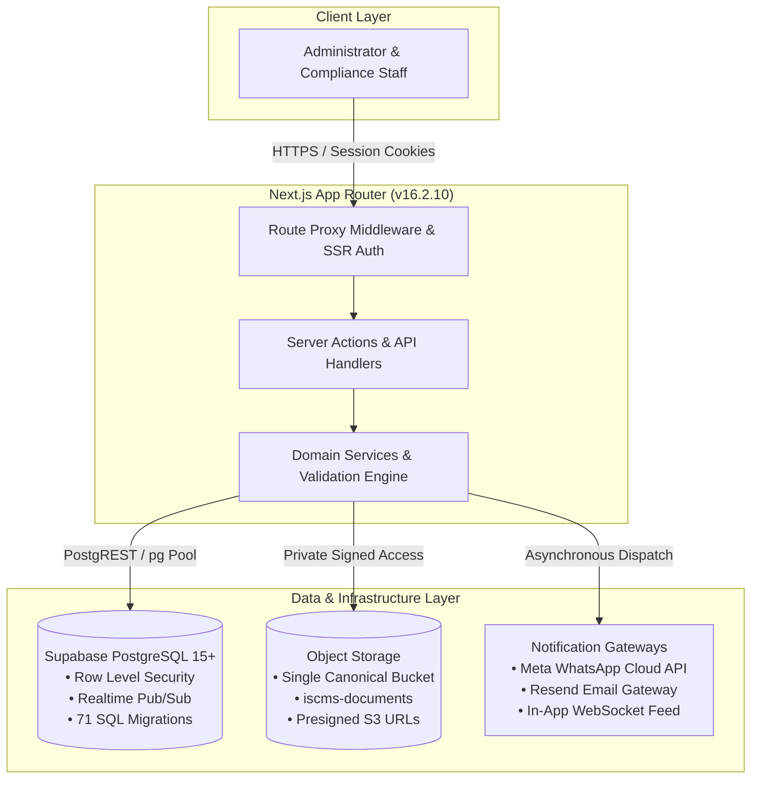
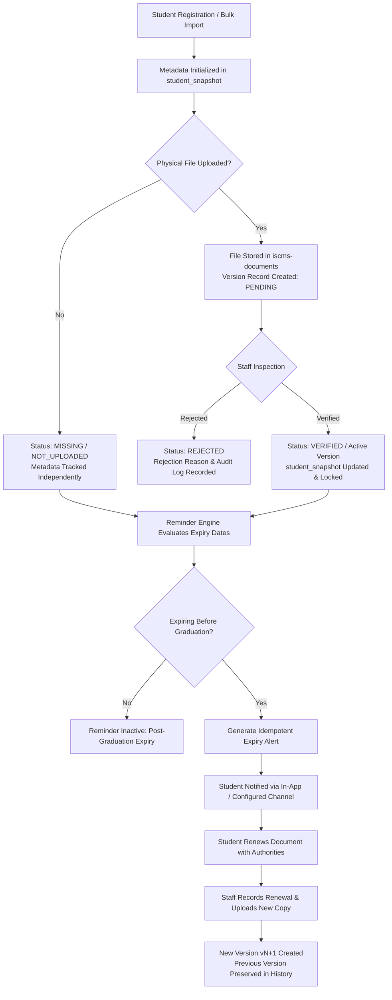
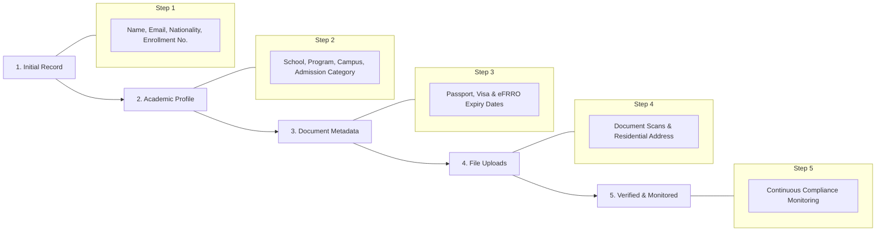

# International Student Compliance Management System

**ISCMS**

<div align="center">

A web-based platform for managing international student records, document compliance, expiry tracking, and institutional compliance workflows.

[-0b3c5d?style=for-the-badge&logo=git&logoColor=white)](./CHANGELOG.md)
[](https://nextjs.org)
[](https://react.dev)
[](https://www.typescriptlang.org)
[](https://tailwindcss.com)
[](https://supabase.com)

</div>

---

## Table of Contents

- [Overview](#overview)
- [Core Capabilities](#core-capabilities)
- [System Architecture](#system-architecture)
- [Technology Stack](#technology-stack)
- [Document Compliance Lifecycle](#document-compliance-lifecycle)
- [Progressive Student Lifecycle](#progressive-student-lifecycle)
- [Academic Data Architecture](#academic-data-architecture)
- [Document Storage Architecture](#document-storage-architecture)
- [Environment Variables](#environment-variables)
- [Local Development](#local-development)
- [Production Deployment & Diagnostics](#production-deployment--diagnostics)
- [Versioning Strategy](#versioning-strategy)
- [Roadmap](#roadmap)
- [Security & Governance](#security--governance)
- [Project Structure](#project-structure)
- [Operational Workflows](#operational-workflows)
- [Release History](#release-history)
- [Ownership & Licensing](#ownership--licensing)

---

## Overview

Higher education institutions hosting international students are subject to strict statutory immigration and residency compliance obligations. Institutions must track mandatory compliance documents across multi-year academic tenures—primarily **Passports**, **Student Visas**, and foreigner registration certificates such as **eFRRO / Residential Permits**.

Managing these obligations through disconnected spreadsheets or manual filing introduces institutional risks:
* **Missed Expirations**: Overlooked document expiry dates lead to visa violations, student disruption, and regulatory liabilities.
* **Metadata vs. Physical File Confusion**: Spreadsheets fail to distinguish between having recorded numbers and holding verified physical copies.
* **Manual Reminder Overhead**: Administrative teams spend disproportionate hours manually auditing calendars and drafting repetitive emails.
* **Audit Trail Deficits**: Lack of historical version tracking when students renew passports or extend visas during their academic programs.

**ISCMS** resolves these challenges by providing a secure, centralized administrative workspace that automates expiration monitoring, manages document versions, verifies compliance metadata, and enforces institutional governance rules.

---

## Core Capabilities

### 👨‍🎓 Student Management
* **Progressive Student Registration**: Create initial student records with minimal required information (name, email, enrollment number, nationality) and complete profile sections over time.
* **Comprehensive Record Tracking**: Manages institutional enrollment identifiers, personal demographics, permanent home addresses, local residential addresses, emergency contacts, and embassy/consulate liaison details.
* **Admission Categories**: Tracks sponsorship types including **ICCR**, **Study in India (SII)**, **Self-Finance**, **Exchange / MoA**, and **Government Sponsored**, with dedicated application tracking identifiers (`iccr_application_number`, `sii_application_number`).
* **Multi-Campus Support**: Supports institutional campus allocations across multi-campus university systems.

### 📄 Document Management
* **Three Mandatory Classifications**: Comprehensive tracking for **Passport**, **Visa**, and **eFRRO / Residential Permit**.
* **Separated Metadata & Version Architecture**: Authoritative calculation snapshots (`student_snapshot`) are maintained independently from physical file upload histories (`passport_versions`, `visa_versions`, `efrro_versions`).
* **Zero Synthetic Versions**: Metadata registered during student onboarding or spreadsheet imports does not create fake file records until genuine files are uploaded.
* **Side-by-Side Verification Workspace**: Synchronized PDF and image viewer allowing compliance officers to compare document metadata against uploaded scans, record staff verification decisions, and submit formal rejection reasons with audit notes.
* **Document Renewal & Version History**: Supports multi-version audit histories (`v1` original, `v2` renewal, `vN+1`) with automatic preservation of original issue and expiry dates.

### 🛂 Compliance Tracking
* **Real-Time Expiry Status**: Continuous calendar calculation categorizes document standing into `COMPLIANT`, `WARNING` (expiring within 30 days), `EXPIRED`, `MISSING`, `PENDING_VERIFICATION`, or `REJECTED`.
* **Institutional Health Scoring**: Dynamic compliance score calculation (0–100) reflecting overall cohort standing.
* **Visual Status Indicators**: Color-coded badges and countdown timers for instant compliance triage.

### 🔔 Reminder Engine
* **Multi-Threshold Expiry Alerts**: Evaluates proactive notifications at **90, 60, 30, 15, and 7 days** prior to document expiration.
* **Graduation Boundary Enforcement**: Suppresses and cancels reminders for documents that expire after the student's expected graduation date (`expected_graduation`), eliminating unnecessary alerts for departed cohorts.
* **Deduplication & Idempotency**: Enforces deterministic idempotency keys (`{student_id}:{document_type}:{threshold_days}`) preventing duplicate notifications across background execution cycles.
* **Multilingual Template Manager**: Configurable notification templates supporting dynamic variable substitution (`{{student_name}}`, `{{expiry_date}}`, `{{days_remaining}}`, `{{enrollment_number}}`, `{{compliance_email}}`, `{{institution_name}}`).

### 🏫 Academic Management
* **Canonical Academic Hierarchy**: Structured data model linking Schools/Departments to Academic Programs and Student Academic profiles.
* **Degree Level Catalog**: Configurable support for Undergraduate (`UG`), Postgraduate (`PG`), Integrated (`INTEGRATED`), Doctoral (`PhD`), and Diploma programs.
* **Semester Progression Engine**: Computes current academic semester and expected graduation date dynamically from admission date and program duration.
* **ICCR Scholarship Scheme Name** (`iccr_scholarship_scheme_name`): Optional free-text field on the Student Academic profile that records the name of the applicable ICCR scholarship scheme (e.g., *Silver Jubilee Scholarship Scheme*, *Africa Scholarship Scheme*). The field is independent of the ICCR Application Number and SII Application Number. Existing students may have no value for this field. It does not affect document compliance, Passport compliance, Visa compliance, eFRRO compliance, reminders, notifications, or document renewal logic. The field is included in the Student Excel Export for authorized users.
* **Last Educational Qualification & Name of University/Institute/School** (`last_educational_qualification`, `last_educational_institution`): Optional fields in the Academic Details section that record the student's prior educational background before enrolling in the university (e.g., *Bachelor of Technology* from *ABC University*). Both fields are completely optional throughout the system, can be populated independently or left blank, and are stored in `public.student_academic`. They are displayed in the Student Profile and included in the Student Excel Export for authorized administrators. As purely informational academic records, neither field affects compliance scoring, document status, passport/visa/eFRRO checks, reminders, or notifications.

### 🌍 Country & Dial Code Master Data
* **ISO 3166-1 Master Catalog**: Built-in dataset containing 120+ countries with official names, 2-letter alpha codes, and international phone dial codes.
* **Searchable Phone Input**: Integrated dial code picker with country flag icons and automatic E.164 phone number formatting.

### 📊 Reporting & Analytics
* **Cohort Compliance Reporting**: Filterable directory for identifying non-compliant or expiring student records.
* **Specialized eFRRO Audits**: Dedicated reports tailored for foreigner registration reporting.
* **Excel Data Ingestion & Export**: Robust bulk spreadsheet import with two-pass validation and one-click atomic batch rollback, alongside structured Excel export utilities.

### 🔐 Security & Access Control
* **Role-Based Access Control**: Dedicated administrative and staff roles protected via Supabase SSR cookie authentication.
* **Database Row Level Security**: PostgreSQL RLS policies active across all application tables.
* **Immutable Audit Trail**: System-wide audit log (`audit_log`) capturing all administrative modifications, imports, and verification actions.

---

## System Architecture

ISCMS utilizes a modern layered architecture with strict separation between client presentation, server business logic, persistent data storage, and external providers:



### Architectural Highlights
1. **Server Actions & Domain Services**: Business logic executes securely on the server with Zod schema validation. Client components never execute privileged database queries directly.
2. **Supabase SSR Authentication**: Cookie-based session tokens validated against PostgreSQL Row Level Security policies on every request.
3. **Storage Abstraction**: File operations route through a centralized storage service utilizing the private `iscms-documents` bucket with time-bounded presigned URLs.
4. **Provider Factory Pattern**: Notification dispatch is decoupled behind `INotificationProvider`, allowing smooth switching between active gateways and test mock providers.

---

## Technology Stack

The versions below reflect the active dependencies declared in [`package.json`](./package.json):

| Layer | Technology | Version / Specification |
| :--- | :--- | :--- |
| **Framework** | Next.js (App Router, Turbopack) | `16.2.10` |
| **UI Library** | React | `19.2.4` |
| **Language** | TypeScript (Strict Mode) | `^5.x` |
| **Styling** | Tailwind CSS / PostCSS | `^4.0` |
| **Component Primitives** | Base UI / Lucide Icons | `@base-ui/react ^1.6.0`, `lucide-react ^1.23.0` |
| **Database** | PostgreSQL on Supabase | PostgreSQL 15+ (`@supabase/supabase-js ^2.110.1`) |
| **Authentication** | Supabase SSR (Secure Cookie Sessions) | `@supabase/ssr ^0.12.3` |
| **Object Storage** | S3-Compatible Private Storage | Single Canonical Bucket (`iscms-documents`) |
| **State & Fetching** | TanStack React Query | `^5.101.2` |
| **Validation** | Zod / React Hook Form | `zod ^4.4.3`, `react-hook-form ^7.80.0` |
| **Spreadsheet Engine** | SheetJS | `xlsx ^0.18.5` |
| **Charts & Metrics** | Recharts | `^3.9.2` |
| **Monitoring** | Sentry Next.js SDK | `@sentry/nextjs ^10.68.0` |
| **Date Calculations** | Day.js & Custom CalendarDateEngine | `dayjs ^1.11.21` |

---

## Document Compliance Lifecycle

ISCMS enforces a structured document lifecycle guaranteeing that verified compliance documents cannot be accidentally overwritten or corrupted:



### Key Lifecycle Principles
1. **Metadata Independence**: Compliance metadata (numbers and expiration dates) can exist without an uploaded physical scan. No synthetic files are generated.
2. **Staff Inspection**: Uploaded files undergo administrative review. Staff can approve or reject files with specific feedback.
3. **Audit History Preservation**: Document renewals generate sequential version records (`v1`, `v2`, `v3`) while preserving original issue and expiration dates in historical records.

---

## Progressive Student Lifecycle

ISCMS accommodates real-world university onboarding workflows where student data is collected incrementally:



---

## Academic Data Architecture

ISCMS implements a canonical three-tier academic hierarchy:

```text
School / Department (e.g., School of Cyber Security & Digital Forensics)
        │
        ▼
Academic Program (e.g., M.Tech Cybersecurity — 4 Semesters, PG)
        │
        ▼
Student Academic Record (Admission Date, Current Semester, Expected Graduation)
```

### Academic Features
* **Semester Calculation**: Automatically determines the student's active semester using admission dates and standard semester durations.
* **Adjustments**: Audited recording of student academic status changes, leaves of absence, and semester adjustments.
* **Referential Integrity**: PostgreSQL constraints prevent deletion of academic programs while active student enrollments exist.
* **Prior Educational Background**: Captures the student's previous qualification and institution (`last_educational_qualification`, `last_educational_institution`) as optional informational fields within the Academic Profile and Excel export.

---

## Document Storage Architecture

ISCMS operates against a single canonical storage bucket:

```text
Bucket: iscms-documents
```

### Path Hierarchy
All compliance documents are organized using deterministic folder paths:

```text
iscms-documents/
└── students/
    └── {student_id}/
        ├── passport/
        │   ├── v1/
        │   │   └── {uuid}.pdf
        │   └── v2/
        │       └── {uuid}.pdf
        ├── visa/
        │   └── v1/
        │       └── {uuid}.png
        └── efrro/
            └── v1/
                └── {uuid}.jpg
```

### Storage Security Controls
* **Private Bucket Access**: Direct public access to the storage bucket is disabled. Documents can only be retrieved through time-bounded presigned URLs (15-minute validity).
* **MIME Magic-Byte Inspection**: Server-side binary header inspection ensures uploaded files match their declared format (`application/pdf`, `image/jpeg`, `image/png`).
* **Configurable Size Limits**: Enforces institutional maximum file size limits (default: 10 MB).

---

## Environment Variables

Configure application settings in `.env.local` using the template below.

> [!CAUTION]
> **Security Rule**: Never prefix administrative or server-side credentials with `NEXT_PUBLIC_`. Keep service role keys and provider API tokens strictly private.

### Public Client Variables (Browser & Server)
```bash
# Supabase Project URL
NEXT_PUBLIC_SUPABASE_URL=https://your-project-id.supabase.co

# Supabase Anonymous Public API Key (Subject to Row Level Security)
NEXT_PUBLIC_SUPABASE_ANON_KEY=eyJhbGciOiJIUzI1NiIsInR5cCI6IkpXVCJ9.your-anon-key

# Institutional Branding Name displayed across UI and notifications
NEXT_PUBLIC_INSTITUTION_NAME="National Forensic Sciences University"

# Canonical Site URL (Optional override; auto-resolved on Vercel)
# NEXT_PUBLIC_APP_URL=https://iscms.youruniversity.edu
```

### Private Server Secrets (Server-Side Only)
```bash
# Administrative Service Role Key (Bypasses Row Level Security for privileged operations)
SUPABASE_SERVICE_ROLE_KEY=eyJhbGciOiJIUzI1NiIsInR5cCI6IkpXVCJ9.your-service-role-key

# Storage Engine Provider (supabase)
STORAGE_PROVIDER=supabase

# Notification Gateways (Optional / Planned)
EMAIL_PROVIDER=mock
# RESEND_API_KEY=re_your_resend_key
# RESEND_FROM_EMAIL=compliance@youruniversity.edu

WHATSAPP_PROVIDER=mock
# META_ACCESS_TOKEN=your_meta_access_token
# META_PHONE_NUMBER_ID=your_meta_phone_number_id
# WHATSAPP_BUSINESS_ACCOUNT_ID=your_waba_account_id

# Cloudflare Turnstile Bot Protection (Optional)
# NEXT_PUBLIC_TURNSTILE_SITE_KEY=0x4AAA...
# TURNSTILE_SECRET_KEY=0x4AAA...
```

---

## Local Development

Follow these steps to run ISCMS locally:

### Prerequisites
* **Node.js**: `v20.x` or higher
* **npm**: `v10.x` or higher
* **Supabase Project**: Managed Supabase cloud instance or local Supabase CLI (PostgreSQL 15+)

### 1. Clone & Install
```bash
git clone https://github.com/saarthvadalia26/International-Student-Compliance-Management-System.git
cd International-Student-Compliance-Management-System
npm install
```

### 2. Configure Environment
```bash
cp .env.example .env.local
```
Edit `.env.local` and supply your `NEXT_PUBLIC_SUPABASE_URL`, `NEXT_PUBLIC_SUPABASE_ANON_KEY`, and `SUPABASE_SERVICE_ROLE_KEY`.

### 3. Database Migration
Apply the 71 SQL migration scripts in `supabase/migrations/` in numerical sequence against your Supabase database instance.

### 4. Run Development Server
```bash
npm run dev
```
Open [http://localhost:3000](http://localhost:3000) in your browser. If connecting to a fresh database, the system will direct you to the **Initial Setup Wizard** (`/setup`).

---

## Production Deployment & Diagnostics

ISCMS is engineered for deployment on **Vercel** connected to **Supabase**.

```text
GitHub Repository ──> Vercel Deployment ──> Supabase (DB & Storage)
```

### Pre-Deployment Verification Gates
Always run quality checks prior to deploying:

```bash
# 1. Lint checks
npm run lint

# 2. TypeScript compilation check
npx tsc --noEmit

# 3. Production build validation
npm run build
```

### Diagnostic & Health Probes
ISCMS exposes operational diagnostic endpoints for monitoring:
* `/dashboard/health`: Interactive administrator diagnostics dashboard.
* `/health`: Core application health status check.
* `/readiness`: Traffic readiness check verifying database and storage connectivity.
* `/liveness`: Process liveness probe.

---

## Versioning Strategy

ISCMS follows [Semantic Versioning 2.0.0](https://semver.org/):

```text
MAJOR . MINOR . PATCH
```

* **Current Stable Release Baseline**: `v0.2.0` (Frozen; no new features will be added to this line).
* **Maintenance Patches**: `v0.2.x` (Critical security or bug fixes only).
* **Next Active Development Target**: `v0.3.0` (All new capabilities and architectural enhancements).

### Version Single Source of Truth
The canonical source of truth for the application version is `package.json`. The module `src/config/version.ts` exports `APP_VERSION` and `getDisplayAppVersion()` for unified display across UI, diagnostic endpoints, and branding headers.

---

## Roadmap

### Current Stable Release (`v0.2.0`) — Complete & Frozen
- [x] Progressive student profile registration & optional field management.
- [x] Canonical academic programs, degree levels, and school catalog.
- [x] Three-document compliance model (Passport, Visa, eFRRO).
- [x] Separated metadata snapshot and version audit history.
- [x] Document renewal workflows with version preservation.
- [x] Graduation boundary reminder suppression logic.
- [x] ISO 3166-1 country master dataset and E.164 phone normalization.
- [x] Bulk Excel student import with two-pass validation and rollback.
- [x] Single canonical bucket storage architecture (`iscms-documents`).
- [x] Initial setup wizard, recovery mode, and live diagnostics.

### In Development (`v0.3.0`) — Planned
- [ ] **Automated External WhatsApp Integration**: Production integration with Meta WhatsApp Business Cloud API for automated dispatch.
- [ ] **Enterprise Email Gateway**: Production SMTP/Resend email notification pipeline.
- [ ] **Advanced Compliance Dossier Exports**: Consolidated PDF report generation for institutional audits.
- [ ] **Automated Document OCR**: Intelligent data extraction from uploaded passport and visa scans.

---

## Security & Governance

ISCMS implements layered defense-in-depth principles:
* **Authentication**: Cookie-based sessions powered by `@supabase/ssr` with `HttpOnly`, `SameSite=Lax`, and `Secure` attributes.
* **Database Isolation**: PostgreSQL Row Level Security (RLS) active across all tables, ensuring strict administrative and staff access control.
* **Strict Role Segregation**: Administrative and staff users are isolated from student database records.
* **Input Sanitization**: All Server Actions validate payloads against strict Zod schemas; spreadsheet imports strip formula injection characters (`=`, `+`, `-`, `@`).
* **Zero Secret Leakage**: System diagnostics endpoints and client-side builds strictly omit private service role keys and API tokens.

---

## Project Structure

```text
.
├── docs/                        # Architectural documentation & deployment guides
│   ├── architecture/            # Architecture Decision Records (ADRs)
│   ├── database/                # Schema documentation & specifications
│   ├── deployment/              # Vercel & Production deployment guides
│   └── releases/                # Milestone release notes
├── public/                      # Static assets, logos, and branding
├── src/
│   ├── app/                     # Next.js App Router
│   │   ├── (app)/               # Protected staff workspace
│   │   │   ├── dashboard/       # Metric cards & /dashboard/health diagnostics
│   │   │   ├── notifications/   # Realtime notification feed
│   │   │   ├── reminders/       # Compliance reminder management
│   │   │   ├── reports/         # Compliance reports (students, eFRRO, audit)
│   │   │   ├── settings/        # Institutional details, academic programs, templates
│   │   │   └── students/        # Student directory, /add, /import, /[id] inspection
│   │   ├── api/                 # Server API routes (health, cron, setup, webhooks)
│   │   ├── login/               # Staff authentication portal
│   │   ├── setup/               # Initial Setup Wizard & Recovery Mode
│   │   └── layout.tsx           # Root layout & providers
│   ├── components/              # Reusable UI components & form elements
│   ├── config/                  # Branding, navigation, and versioning configuration
│   ├── domain/                  # Core domain logic
│   │   ├── academic/            # Semester progression and academic adjustments
│   │   ├── compliance/          # Document services and verification logic
│   │   ├── countries/           # ISO country master catalog & dial codes
│   │   ├── import/              # Bulk spreadsheet import engine
│   │   ├── notifications/       # Reminder engine, calendar calculations, templates
│   │   ├── storage/             # Object storage provider factory
│   │   └── system/              # Live diagnostics and health probes
│   ├── hooks/                   # Custom React hooks
│   ├── lib/                     # Supabase client helpers and utilities
│   └── providers/               # Theme, Realtime, and Query context providers
├── supabase/
│   └── migrations/              # 71 sequential PostgreSQL SQL migration files
├── tests/                       # Automated domain test suites
├── CHANGELOG.md                 # Complete release history
├── package.json                 # Project dependencies & canonical version
└── README.md                    # Project documentation
```

---

## Operational Workflows

### Initial Setup Wizard
When deploying to a fresh database, ISCMS automatically detects the uninitialized state and presents the **Initial Setup Wizard** at `/setup`. The wizard guides administrators through database connectivity verification, initial administrator account creation, and institutional localization defaults, subsequently locking `/setup` to prevent re-initialization.

### Daily Compliance Monitoring
The reminder engine evaluates document expirations against active reminder rules and student graduation dates. Reminders reaching threshold intervals are queued for notification dispatch and logged in the delivery audit trail.

---

## Release History

Detailed release logs and migration histories are available in [CHANGELOG.md](./CHANGELOG.md).

* **[v0.2.0 — Current Stable Baseline](./CHANGELOG.md#020---2026-08-30)**
* **[v0.3.0 — Next Development Cycle](./CHANGELOG.md#030---in-development)**
* **[v0.1.0 — Initial Release](./CHANGELOG.md#010---2026-08-15)**

---

## Ownership & Licensing

ISCMS is institutional software developed for higher-education international student offices.
Unauthorized reproduction, distribution, or public commercial distribution is prohibited without explicit authorization.

© 2026. All rights reserved.
