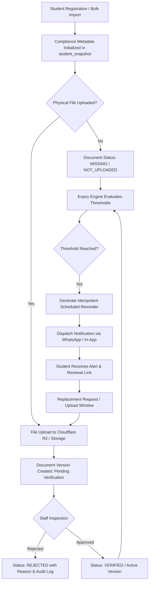

# ISCMS

<div align="center">

### International Student Compliance Management System

A centralized platform engineered for higher-education institutions, universities, and international student offices to manage international student immigration documents, compliance metadata, document versions, expiration monitoring, automated reminder workflows, and administrative governance.

[](https://nextjs.org)
[](https://react.dev)
[](https://www.typescriptlang.org)
[](https://tailwindcss.com)
[](https://supabase.com)
[](https://www.cloudflare.com/developer-platform/r2/)

</div>

---

## Table of Contents

- [Overview](#overview)
- [What ISCMS Manages](#what-iscms-manages)
- [Core Compliance Workflow](#core-compliance-workflow)
- [Key Features](#key-features)
- [System Architecture](#system-architecture)
- [Technology Stack](#technology-stack)
- [Core Data Model](#core-data-model)
- [Document Lifecycle & Replacement](#document-lifecycle--replacement)
- [Compliance Reminder Engine](#compliance-reminder-engine)
- [Notification Templates](#notification-templates)
- [Bulk Student Import](#bulk-student-import)
- [Document Storage Architecture](#document-storage-architecture)
- [Security Considerations](#security-considerations)
- [Environment Variables](#environment-variables)
- [Getting Started](#getting-started)
- [Deployment](#deployment)
- [Testing & Verification](#testing--verification)
- [Project Structure](#project-structure)
- [Operational Workflows](#operational-workflows)
- [Integration Status](#integration-status)
- [Documentation Index](#documentation-index)
- [Ownership & Licensing](#ownership--licensing)

---

## Overview

Higher education institutions hosting international students are subject to strict statutory immigration and residency compliance regulations. Compliance tracking typically spans multiple mandatory documents—primarily **Passports**, **Student Visas**, and national foreigner registration certificates such as **eFRRO / Residential Permits**.

Managing these obligations via disconnected spreadsheets or manual filing introduces severe institutional risks:
* **Overlooked Expiration Dates**: Document expirations lead to visa violations, deportation risks, and institutional penalties.
* **Metadata vs. File Ambiguity**: Traditional systems often fail to distinguish between possessing confirmed document data and holding a verified physical copy.
* **Manual Reminder Overhead**: Staff spend disproportionate hours manually checking expiry dates and sending individual emails or messages.
* **Audit Trail Gaps**: Lack of historical version tracking when passports or visas are renewed during a multi-year academic program.

**ISCMS** resolves these challenges by providing a centralized, role-isolated web platform:
1. **Administrative Workspace (`/dashboard`, `/students`, `/reminders`, `/reports`, `/settings`)**: Empowers international student advisors and compliance officers to manage student registries, review uploaded documents side-by-side, approve or reject versions with audit notes, configure automated reminder schedules, and generate compliance reports.
2. **Student Portal (`/student/dashboard`, `/student/notifications`, `/student/efrro`, `/student/profile`)**: Provides enrolled international students with a responsive, self-service interface to view their compliance standing, review document validity, upload renewed document copies, and receive notifications via passwordless authentication.

---

## What ISCMS Manages

ISCMS tracks compliance across three core document classifications, maintaining a strict architectural boundary between **compliance metadata** (numbers, issue dates, expiration dates) and **physical document files** (uploaded PDFs or images).

```text
                      ISCMS Compliance Entities
                                  │
         ┌────────────────────────┼────────────────────────┐
         │                        │                        │
         ▼                        ▼                        ▼
   ╔════════════╗           ╔════════════╗           ╔════════════╗
   ║  Passport  ║           ║    Visa    ║           ║   eFRRO    ║
   ╚════════════╝           ╚════════════╝           ╚════════════╝
   • Number                 • Visa Number            • Certificate / Reg No
   • Issue Date             • Visa Type / Category   • Issue Date
   • Expiry Date            • Issue Date             • Expiry Date
   • Place of Issue         • Expiry Date            • Expiry Date Tracking
   • Uploaded Copy          • Uploaded Copy          • Uploaded Copy
   • Version History        • Version History        • Version History
   • Renewal Alerts         • Renewal Alerts         • Renewal Alerts
```

### 1. Passport
* **Metadata**: Passport number, issuing country, place of issue, issue date, and expiry date.
* **Document Copies**: Physical copies stored in isolated storage paths, supporting PDF, JPEG, and PNG formats with magic-byte validation.
* **Verification & Versioning**: Version sequence tracking (`v1`, `v2`, etc.) when students renew their passports during academic tenure.
* **Reminder Schedule**: Proactive reminder rules evaluated at scheduled threshold intervals (90, 60, 30, 15, and 7 days prior to expiration).

### 2. Visa
* **Metadata**: Visa number, visa type/classification (e.g. *Student (S-1)*), issue date, and expiry date.
* **Document Copies**: Verified or pending document files linked directly to the student record.
* **Verification & Versioning**: Multi-version audit trail with staff approval/rejection notes.
* **Reminder Schedule**: Scheduled expiry alerts dispatched via WhatsApp and in-app notifications.

### 3. eFRRO / Residential Permit
* **Metadata**: Registration/certificate number, issue date, and expiry date.
* **Document Copies**: Scanned residential permit certificates uploaded by students or compliance officers.
* **Verification & Versioning**: Full lifecycle management with staff verification workflows.
* **Reminder Schedule**: Expiration monitoring with automated renewal notifications.

> [!IMPORTANT]
> **Metadata Independence**: In ISCMS, compliance metadata can exist independently of a physical document file. For instance, when student records are imported in bulk from institutional spreadsheets, their passport and visa numbers and expiry dates are stored in the authoritative metadata snapshot (`student_snapshot`) with a status of `MISSING` (or `not_uploaded`). No fake document versions or storage files are generated until a genuine document is uploaded.

---

## Core Compliance Workflow

The diagram below illustrates the end-to-end lifecycle from student onboarding to document verification, automated expiry monitoring, and document replacement:



---

## Key Features

### Student Registry & Academic Management
* **Centralized Registry**: Tabular student directory with real-time search across student names, university enrollment numbers, registration IDs, passport numbers, and nationalities.
* **Academic Program Integration**: Configurable academic catalog tracking degree levels, schools, total semesters, and semester durations.
* **Semester Progression Engine**: Automatic computation of current semester, expected graduation date, and academic stages based on admission date.
* **Academic Adjustments**: Audited recording of student program changes, semester repeats, leaves of absence, and semester skips.
* **Contact & Embassy Records**: Comprehensive tracking of permanent address, local residential address, emergency contacts, and embassy/consulate liaison details.

### Compliance Document Management
* **Separated Metadata & Version Architecture**: Authoritative calculation snapshots separate from immutable physical file version histories (`passport_versions`, `visa_versions`, `efrro_versions`).
* **Side-by-Side Inspection Interface**: Staff workspace featuring synchronized PDF/image viewers, metadata comparison, and approval/rejection forms.
* **Upload Lock & Eligibility Guard**: Upload controls preventing accidental or unauthorized overwrites; requires an active replacement request or staff-issued early authorization window.
* **Document Replacement Workflows**: Student-initiated or staff-created replacement requests with approval queues and automatic lock resolution upon successful upload.

### Compliance Tracking & Scoring
* **Continuous Expiry Evaluation**: Calendar-day difference calculations determining real-time status: `COMPLIANT`, `WARNING` (<60 days remaining), `EXPIRED` (≤0 days), `PENDING_VERIFICATION`, or `NOT_UPLOADED`.
* **Institutional Health Scoring**: Normalized compliance score calculation based on active verified document coverage.
* **Visual Status Indicators**: Color-coded badges and countdown indicators across both administrative and student views.

### Automated Notifications & Reminders
* **Multi-Interval Reminder Rules**: Configurable alert thresholds at **90, 60, 30, 15, and 7 days** prior to document expiration.
* **Idempotent Dispatch**: Unique idempotency keys (`{student_id}:{document_type}:{threshold_days}`) preventing duplicate notifications.
* **Multilingual Template Manager**: Templated messages with dynamic placeholders (`{{student_name}}`, `{{expiry_date}}`, `{{days_remaining}}`, `{{enrollment_number}}`, `{{institution_name}}`) supporting English, Hindi, and Spanish.
* **Realtime In-App Notifications**: WebSocket-backed notification center for staff and students powered by Supabase Realtime publications.
* **Delivery Logging & Audit**: Complete delivery tracking recording status (`queued`, `sending`, `sent`, `failed`), timestamps, and gateway error messages.

### Student Portal
* **Passwordless Authentication**: Secure login via single-use 7-day magic links or time-based OTP codes.
* **Self-Service Compliance Dashboard**: Mobile-optimized overview of document validity and required actions.
* **Direct Document Upload**: Client-side validated file uploads with progress tracking and SHA-256 duplicate checksum detection.
* **Activity & Version History**: Student visibility into historical document submissions and verification decisions.
* **Developer Test Mode**: Configurable test flag (`STUDENT_PORTAL_TEST_MODE`) for rapid local UI evaluation without live OTP credentials.

### Bulk Student Import Engine
* **Spreadsheet Parsing**: Ingests `.xlsx`, `.xls`, and `.csv` files using SheetJS (`xlsx`).
* **Intelligent Auto-Mapping**: Automatic column matching based on header alias dictionaries with manual override controls.
* **Two-Pass Production Validation**: Comprehensive row-by-row validation distinguishing between fatal errors (blocking import) and non-blocking warnings (missing optional fields).
* **Formula Injection Sanitization**: Strips spreadsheet formula injection vectors while preserving standard international phone prefixes (`+`).
* **Batch Auditing & Atomic Rollback**: Imports are tracked under `import_batches` with batch numbers, error summaries, and one-click batch deletion.

### System Governance & Administration
* **Initial Setup Wizard (`/setup`)**: Automated detection of uninitialized databases directing administrators through health verification, credential creation, and institutional configuration.
* **Emergency Recovery Mode**: Secure mechanism to restore primary administrative access without altering existing compliance data.
* **Immutable Audit Trail**: System-wide audit log (`audit_log`) recording logins, verification actions, imports, and configuration updates.
* **Live System Diagnostics (`/dashboard/health`)**: Real-time latency tracking for database connection pools, Cloudflare R2 object storage, and notification services.

---

## System Architecture

ISCMS employs a modern layered architecture with strict separation between client interaction, server business logic, persistent data storage, and external providers:

```text
┌─────────────────────────────────────────────────────────────────────────┐
│                           Client Presentation                           │
│                                                                         │
│   ┌────────────────────────────────┐   ┌────────────────────────────┐   │
│   │   Admin / Staff Workspace      │   │       Student Portal       │   │
│   │   (/dashboard, /students, etc.)│   │   (/student/dashboard, etc.)│   │
│   └────────────────┬───────────────┘   └─────────────┬──────────────┘   │
└────────────────────┼─────────────────────────────────┼──────────────────┘
                     │                                 │
                     ▼                                 ▼
┌─────────────────────────────────────────────────────────────────────────┐
│                    Next.js App Router (v16.2.10)                        │
│                                                                         │
│   ┌─────────────────────────────────────────────────────────────────┐   │
│   │   Edge Proxy Middleware (Route Protection, SSR Cookies, CSP)    │   │
│   └────────────────┬────────────────────────────────────────────────┘   │
│                    │                                                    │
│   ┌────────────────▼────────────────────────────────────────────────┐   │
│   │   Server Actions & Domain Services                              │   │
│   │   • StudentService            • ExpiryReminderEngine            │   │
│   │   • ComplianceDocumentService • BulkStudentImportService        │   │
│   │   • SemesterProgressionEngine • SystemDiagnosticsService        │   │
│   └───────┬──────────────────────────┬──────────────────────┬───────┘   │
└───────────┼──────────────────────────┼──────────────────────┼───────────┘
            │                          │                      │
            ▼                          ▼                      ▼
┌──────────────────────┐    ┌──────────────────────┐   ┌──────────────────┐
│     Supabase DB      │    │    Cloudflare R2     │   │   Notification   │
│   (PostgreSQL 15+)   │    │    Object Storage    │   │     Gateways     │
│                      │    │                      │   │                  │
│ • Row Level Security │    │ • Single Bucket      │   │ • Meta WhatsApp  │
│ • 44 Migrations      │    │   (iscms-documents)  │   │   Business Cloud │
│ • Triggers & Views   │    │ • Deterministic Keys │   │ • Resend Email   │
│ • Realtime Pub/Sub   │    │ • Presigned URLs     │   │ • In-App Streams │
└──────────────────────┘    └──────────────────────┘   └──────────────────┘
```

### Architectural Highlights
1. **Next.js App Router & Server Actions**: Core business logic executes entirely on the server with Zod validation, ensuring client components never directly execute privileged database operations.
2. **Supabase SSR Authentication**: Cookie-based session tokens validated against PostgreSQL Row Level Security policies.
3. **Storage Abstraction**: Storage operations route through `StorageProviderFactory`, utilizing Cloudflare R2 via `@aws-sdk/client-s3` in production with fallback support for native Supabase Storage buckets.
4. **Provider Pattern for Messaging**: Notification dispatch is decoupled behind `INotificationProvider`, allowing dynamic switching between Meta WhatsApp, Resend Email, and mock test providers.

---

## Technology Stack

The versions and libraries below reflect the active dependencies declared in [`package.json`](file:///d:/Saarth/Saarth/International%20Student%20Compliance%20Management%20System/package.json):

| Layer | Technology | Specification / Version |
| :--- | :--- | :--- |
| **Framework** | Next.js (App Router, Turbopack) | `16.2.10` |
| **UI Library** | React | `19.2.4` |
| **Language** | TypeScript (Strict Mode) | `^5.x` |
| **Styling** | Tailwind CSS / PostCSS | `^4.x` |
| **UI Components** | shadcn/ui / Base UI / Lucide Icons | `@base-ui/react ^1.6.0`, `lucide-react ^1.23.0` |
| **Database** | PostgreSQL on Supabase | PostgreSQL 15+ (`@supabase/supabase-js ^2.110.1`) |
| **Authentication** | Supabase SSR (Secure Cookie Sessions) | `@supabase/ssr ^0.12.3` |
| **Object Storage** | Cloudflare R2 (S3-Compatible Client) | `@aws-sdk/client-s3 ^3.1098.0`, `@aws-sdk/s3-request-presigner ^3.1098.0` |
| **State & Fetching** | TanStack React Query | `^5.101.2` |
| **Realtime Engine** | Supabase Realtime WebSockets | `@supabase/supabase-js ^2.110.1` |
| **Validation** | Zod / React Hook Form | `zod ^4.4.3`, `react-hook-form ^7.80.0` |
| **Spreadsheet Engine**| SheetJS | `xlsx ^0.18.5` |
| **Charts & Metrics** | Recharts | `^3.9.2` |
| **Monitoring** | Sentry Next.js SDK | `@sentry/nextjs ^10.68.0` |
| **Testing** | Node Test Runner / Playwright | `@playwright/test ^1.62.0` |

---

## Core Data Model

ISCMS is backed by a relational schema in PostgreSQL managed through 44 sequential database migrations.

```mermaid
erDiagram
    students ||--|| student_snapshot : "authoritative compliance metadata"
    students ||--o| student_academic : "enrollment details"
    students ||--o{ student_academic_adjustments : "progression changes"
    students ||--o{ passport_versions : "physical passport uploads"
    students ||--o{ visa_versions : "physical visa uploads"
    students ||--o{ efrro_versions : "physical efrro uploads"
    students ||--o{ student_document_replacement_requests : "requests"
    students ||--o{ student_early_upload_authorizations : "upload windows"
    students ||--o{ student_upload_tokens : "single-use tokens"
    students ||--o{ notifications : "scheduled alerts"
    students }o--o| import_batches : "created by batch"
    
    notifications ||--o{ notification_delivery_log : "delivery attempts"
    reminder_rules }o--o| notification_templates : "uses template"
    academic_programs ||--o{ student_academic : "course curriculum"

    students {
        uuid id PK
        string university_enrollment_number
        string registration_number
        string full_name
        string email
        string phone_home
        string country_of_citizenship
        string status
        uuid import_batch_id FK
    }

    student_snapshot {
        uuid student_id PK, FK
        string passport_number
        date passport_expiry
        string passport_status
        string visa_number
        date visa_expiry
        string visa_status
        string efrro_number
        date efrro_expiry
        string efrro_status
        int compliance_score
        string compliance_status
    }

    passport_versions {
        uuid id PK
        uuid student_id FK
        int version_number
        string document_number
        date expiry_date
        string file_path
        string verification_status
        uuid verified_by
        boolean is_active
    }

    visa_versions {
        uuid id PK
        uuid student_id FK
        int version_number
        string document_number
        date expiry_date
        string file_path
        string verification_status
        uuid verified_by
        boolean is_active
    }

    efrro_versions {
        uuid id PK
        uuid student_id FK
        int version_number
        string document_number
        date expiry_date
        string file_path
        string verification_status
        uuid verified_by
        boolean is_active
    }

    import_batches {
        uuid id PK
        string batch_number
        string file_name
        int total_rows
        int imported_count
        int failed_count
        string status
        jsonb error_summary
    }

    reminder_rules {
        uuid id PK
        string document_type
        int alert_threshold_days
        string channel
        boolean is_active
        string rule_name
        uuid template_id FK
    }
```



### Key Tables & Responsibilities
* `students`: Core demographic record, university enrollment identifier, and nationality.
* `student_snapshot`: Primary compliance metadata cache. Updated automatically upon document verification or import.
* `passport_versions`, `visa_versions`, `efrro_versions`: Immutable audit tables containing verified or pending physical file uploads. The database enforces a `CHECK (file_path IS NOT NULL AND file_path <> '')` constraint on these tables.
* `student_document_replacement_requests`: Formal audit requests to unlock and replace verified compliance documents.
* `student_early_upload_authorizations`: Staff-granted time-bounded authorization windows to bypass standard document upload locks.
* `notifications` & `notification_delivery_log`: Asynchronous notification queues, scheduled trigger dates, idempotency hashes, and gateway delivery receipts.
* `notification_templates`: Multilingual notification content with versioning and parameter placeholders.
* `reminder_rules`: Trigger thresholds and target channels for each document classification.
* `import_batches`: Auditable records of bulk spreadsheet uploads enabling atomic review and rollback.
* `audit_log`: System-wide audit log recording all administrative modifications.

---

## Document Lifecycle & Replacement

ISCMS enforces a structured document lifecycle designed to guarantee that verified documents cannot be accidentally overwritten or corrupted:

```text
  1. METADATA REGISTRATION
     • Student is onboarded (manually or via bulk import).
     • Expiry dates and document numbers recorded in `student_snapshot`.
     • Document status initialized to MISSING / not_uploaded.
                               │
                               ▼
  2. PHYSICAL FILE SUBMISSION
     • Student or staff uploads PDF/image (max size dynamically enforced, default 10MB).
     • Magic-number validation ensures file content matches extension.
     • Stored in Cloudflare R2: `students/{id}/{type}/v1/{uuid}.pdf`.
     • Version record created in `*_versions` table with status `pending`.
                               │
                               ▼
  3. ADMINISTRATIVE INSPECTION
     • Staff reviews document in side-by-side inspection view.
     • Decision:
       ├── REJECTED ──> Staff provides rejection reason; file scheduled for deletion.
       └── VERIFIED ──> Status set to `verified`; `student_snapshot` refreshed;
                        document is locked against further modification.
                               │
                               ▼
  4. EXPIRATION MONITORING
     • Daily evaluation calculates calendar-day difference to expiry.
     • Scheduled reminder rules trigger automated alerts at 90, 60, 30, 15, and 7 days.
                               │
                               ▼
  5. DOCUMENT REPLACEMENT (When renewed)
     • Student or staff initiates a Replacement Request with renewal details.
     • Staff approves request (or automatic renewal window opens).
     • New document uploaded; version number increments to `v2`.
     • Previous version deactivated and marked as superseded in audit logs.
```

---

## Compliance Reminder Engine

The compliance reminder engine calculates, schedules, and dispatches multi-channel expiration alerts across all compliance documents.

### Calculation Mechanics
* **Timezone-Safe Calendar Diff**: Evaluates calendar-day differences between the target document's `expiry_date` and today's date using `CalendarDateEngine` to eliminate daylight saving or time-of-day offsets.
* **Standard Thresholds**: Evaluates rules across five standard intervals:
  * **90 Days**: Early warning notification.
  * **60 Days**: Administrative renewal advisory.
  * **30 Days**: Urgent expiration warning.
  * **15 Days**: Critical renewal alert.
  * **7 Days**: Final pre-expiration notice.
* **Handling Missing Expiry Dates**: If a document has no recorded expiration date, the engine flags the schedule as `NOT_APPLICABLE` with the reason *"Expiry date has not been recorded"*.
* **Handling Metadata-Only Records**: When document metadata exists without an uploaded file copy, reminders still evaluate against the recorded expiry date, prompting the student to submit their renewed physical document.
* **Deduplication & Idempotency**: Before queueing or sending a notification, the engine verifies that no record exists with the unique key:
  ```text
  {student_id}:{document_type}:{threshold_days}
  ```
  This guarantees that duplicate alerts are never dispatched even if background jobs run repeatedly.

---

## Notification Templates

ISCMS includes a template management architecture allowing compliance staff to customize notification messages.

### Placeholders & Substitution
Templates utilize double-curly-brace placeholder syntax:
* `{{student_name}}`: Student's full name.
* `{{enrollment_number}}`: University enrollment identifier.
* `{{document_type}}`: Passport, Visa, or eFRRO.
* `{{expiry_date}}`: Formatted expiration date (`YYYY-MM-DD`).
* `{{days_remaining}}`: Integer countdown of days until expiry.
* `{{institution_name}}`: Institutional branding name.

### Multilingual Support
The database seed includes pre-configured templates across multiple languages:
* **English (`en`)**: Primary institutional alerts.
* **Hindi (`hi`)**: Regional multilingual notifications.
* **Spanish (`es`)**: International language variant.

### Template Configuration vs. Provider Dispatch
* **Template Storage**: Templates are stored and versioned in the `notification_templates` database table.
* **Channel Architecture**: While templates support multi-channel formatting (`whatsapp`, `email`, `both`), migration `043` standardizes operational triggers to **WhatsApp** and **In-App** delivery pending active email gateway configuration.

---

## Bulk Student Import

The Bulk Student Import subsystem enables compliance administrators to onboard entire cohorts from institutional spreadsheets.

```text
┌────────────────────────┐
│  Upload Spreadsheet    │ (.xlsx, .xls, .csv via SheetJS)
└───────────┬────────────┘
            │
            ▼
┌────────────────────────┐
│ Intelligent Mapping    │ Auto-detects headers (e.g. "Passport No" -> passport_number)
└───────────┬────────────┘
            │
            ▼
┌────────────────────────┐
│ Two-Pass Validation    │ Evaluates duplicate emails, format regex, and missing fields
└───────────┬────────────┘
            │
            ├── [Fatal Errors Exist] ──> Blocks execution, exports downloadable Error Report
            │
            └── [Validation Clean]   ──> Creates Import Batch Record
                                                │
                                                ▼
                                         ┌────────────────────────┐
                                         │ Atomic Insertion       │
                                         │ • students             │
                                         │ • student_contact      │
                                         │ • student_academic     │
                                         │ • student_snapshot     │
                                         │ (NO fake file versions)│
                                         └────────────────────────┘
```

### Import Principles & Safeguards
1. **No Fake Document Versions**: Bulk import populates demographic, academic, and metadata snapshot records (`student_snapshot`). It **never** inserts fake version records into `passport_versions`, `visa_versions`, or `efrro_versions` when no physical file exists.
2. **Handling Optional Fields**: Optional contact or embassy fields are stored cleanly as `NULL` without breaking relational constraints.
3. **Spreadsheet Sanitization**: Strips leading formula injection characters (`=`, `+`, `-`, `@`) while preserving standard phone formatting.
4. **Downloadable Template**: The system provides an instant template generator (`/students/import`) outputting a pre-formatted Excel file with headers and sample records.
5. **Audited Rollback**: Each import is linked to a batch ID in `import_batches`. Administrators can rollback a batch, removing all associated student records in a single audited action.

---

## Document Storage Architecture

ISCMS utilizes an S3-compatible private object storage architecture powered by **Cloudflare R2** with an automatic fallback to **Supabase Storage**.

### Single Canonical Bucket Architecture
The storage subsystem operates on a single canonical bucket:
```text
Bucket: iscms-documents
```

All uploaded compliance documents are organized using deterministic key prefixes:
```text
iscms-documents/
└── students/
    └── {student_id}/
        ├── passport/
        │   └── v{version_number}/
        │       └── {uuid}.pdf
        ├── visa/
        │   └── v{version_number}/
        │       └── {uuid}.png
        └── efrro/
            └── v{version_number}/
                └── {uuid}.jpg
```

### Storage Security Controls
* **Private Bucket Access**: The storage bucket has public read access disabled. Files can only be retrieved via time-bounded, server-generated presigned S3 URLs (`@aws-sdk/s3-request-presigner`) with a 15-minute expiration window.
* **Magic-Number Signature Inspection**: File uploads are inspected server-side via `FileSignatureValidator` to ensure the binary magic bytes match the declared MIME type (`application/pdf`, `image/jpeg`, `image/png`).
* **Configurable File Size Limits**: Dynamic single-source-of-truth validation (default: 10 MB).
* **SHA-256 Checksum Verification**: Detects identical duplicate file uploads before committing storage writes.

---

## Security Considerations

ISCMS implements defense-in-depth security principles across every tier:

### 1. Authentication & Session Management
* **Cookie-Based Sessions**: Built on `@supabase/ssr` with `HttpOnly`, `SameSite=Lax`, and `Secure` session cookies.
* **Role Verification**: User roles (`admin`, `staff`, `student`) are embedded in cryptographically signed JWT metadata and validated server-side on every request.

### 2. Database Authorization (Row Level Security)
* PostgreSQL Row Level Security (RLS) is enabled and enforced across all core tables.
* Students can only query records where `user_id = auth.uid()` or matching their assigned `student_id`.
* Administrative endpoints utilize `getAdminSupabase()` only within authenticated Server Actions after verifying administrator role credentials.

### 3. HTTP Headers & Content Security
The application proxy enforces security headers on all responses:
* `X-Frame-Options: DENY` (prevents clickjacking)
* `X-Content-Type-Options: nosniff` (prevents MIME sniffing)
* `Referrer-Policy: strict-origin-when-cross-origin`
* `Strict-Transport-Security: max-age=31536000; includeSubDomains; preload`

### 4. Input Sanitization
* All Server Actions validate input payloads against strict **Zod schemas**.
* Spreadsheet imports sanitize formula characters (`=`, `+`, `-`, `@`).

---

## Environment Variables

The table below documents all environment variables used by ISCMS.

> [!CAUTION]
> **Never commit actual secret values, service role keys, or API tokens to source control.** Store production credentials securely in your hosting environment (e.g. Vercel Project Settings).

| Variable | Description | Scope | Required |
| :--- | :--- | :--- | :--- |
| `NEXT_PUBLIC_SUPABASE_URL` | REST endpoint URL of your Supabase project instance | Browser & Server | **Yes** |
| `NEXT_PUBLIC_SUPABASE_ANON_KEY` | Public anonymous API key subject to Row Level Security | Browser & Server | **Yes** |
| `SUPABASE_SERVICE_ROLE_KEY` | Administrative service-role key capable of bypassing RLS | Server Only | **Yes** |
| `SUPABASE_JWT_SECRET` | Secret used for verifying auth tokens and OTP generation | Server Only | Optional |
| `STORAGE_PROVIDER` | Blob storage engine (`cloudflare-r2` or `supabase`) | Server Only | **Yes** |
| `R2_ACCOUNT_ID` | Cloudflare account identifier for R2 API | Server Only | If R2 enabled |
| `R2_ACCESS_KEY_ID` | Cloudflare R2 S3-compatible Access Key ID | Server Only | If R2 enabled |
| `R2_SECRET_ACCESS_KEY` | Cloudflare R2 S3-compatible Secret Access Key | Server Only | If R2 enabled |
| `R2_BUCKET_NAME` | Target R2 bucket name (defaults to `iscms-documents`) | Server Only | Optional |
| `R2_ENDPOINT` | Custom S3 endpoint override URL for Cloudflare R2 | Server Only | Optional |
| `WHATSAPP_PROVIDER` | WhatsApp engine (`meta` or `mock`) | Server Only | Optional |
| `META_ACCESS_TOKEN` | Meta Business Cloud API access token for WhatsApp | Server Only | If Meta active |
| `META_PHONE_NUMBER_ID` | Meta Business phone number ID for outbound messages | Server Only | If Meta active |
| `WHATSAPP_BUSINESS_ACCOUNT_ID` | Meta WhatsApp Business Account ID | Server Only | Optional |
| `EMAIL_PROVIDER` | Email engine (`resend` or `mock`) | Server Only | Optional |
| `RESEND_API_KEY` | Resend API key for outbound institutional email | Server Only | If Resend active |
| `RESEND_FROM_EMAIL` | Verified sender email address for system notifications | Server Only | Optional |
| `CRON_SECRET` | Bearer secret protecting scheduled background execution | Server Only | Optional |
| `NEXT_PUBLIC_INSTITUTION_NAME` | Institutional branding name displayed in notifications | Browser & Server | Optional |
| `NEXT_PUBLIC_STUDENT_PORTAL_TEST_MODE` | Set to `"false"` in production to enforce live OTP login | Browser & Server | Optional |

---

## Getting Started

Follow these steps to configure and run ISCMS locally:

### Prerequisites
* **Node.js**: `v20.x` or higher
* **Package Manager**: `npm` (v10+)
* **Supabase Project**: A managed Supabase project or local Supabase CLI instance (PostgreSQL 15+)
* **Cloudflare R2 Bucket**: (Optional for local testing; system falls back to Supabase Storage or mock)

### 1. Installation
Clone the repository and install dependencies:
```bash
git clone https://github.com/saarthvadalia26/International-Student-Compliance-Management-System.git
cd International-Student-Compliance-Management-System
npm install
```

### 2. Environment Configuration
Create a `.env.local` file by copying the template:
```bash
cp .env.example .env.local
```
Open `.env.local` and supply your `NEXT_PUBLIC_SUPABASE_URL`, `NEXT_PUBLIC_SUPABASE_ANON_KEY`, and `SUPABASE_SERVICE_ROLE_KEY`.

### 3. Database Migrations
Execute the SQL migration files in `supabase/migrations/` (files `001` through `044`) in sequential order in your Supabase SQL Editor to provision tables, security functions, indexes, triggers, and Row Level Security policies.

### 4. Run Development Server
Start the Next.js development server:
```bash
npm run dev
```
Open [http://localhost:3000](http://localhost:3000) in your browser. If running on a fresh database, the system will automatically direct you to the **Initial Setup Wizard** (`/setup`).

---

## Deployment

ISCMS is engineered for deployment on **Vercel** connected to **Supabase Cloud** and **Cloudflare R2**.

### 1. Build Verification
Before deploying, verify that the project builds cleanly:
```bash
# 1. Lint checks
npm run lint

# 2. Strict TypeScript type check
npx tsc --noEmit

# 3. Next.js production build
npm run build
```

### 2. Hosting Configuration
1. Import the repository into your Vercel team account.
2. In the Vercel Project Settings, add all required **Environment Variables** listed in the table above.
3. Deploy the project.

### 3. Health & Monitoring Endpoints
ISCMS provides dedicated diagnostic endpoints:
* `/dashboard/health`: Interactive administrator diagnostics dashboard.
* `/health`: Core application health status check.
* `/readiness`: Traffic readiness check verifying database and storage connectivity.
* `/liveness`: Process liveness probe.

---

## Testing & Verification

The repository includes a comprehensive test suite covering domain logic, validation engines, storage lifecycles, and compliance rules:

```bash
# Run unit & domain integration tests
node --import ./tests/test-preload.ts --test tests/*.test.ts

# Run End-to-End browser tests (Playwright)
npx playwright test
```

### Verified Test Areas
* **Academic Semester Progression**: Validates progression logic across program durations (`tests/academic-semester-progression.test.ts`).
* **Bulk Student Import Validation**: Validates Excel parsing, column mapping, and duplicate checks (`tests/bulk-student-import.test.ts`).
* **Document Metadata & Version Separation**: Verifies that metadata exists independently of file versions (`tests/document-metadata-version-separation.test.ts`).
* **R2 Single Bucket Architecture**: Tests storage path structures and presigned URL operations (`tests/r2-single-bucket-architecture.test.ts`).
* **Document Agnostic Reminders**: Tests schedule calculations for passport, visa, and eFRRO (`tests/document-agnostic-reminders.test.ts`).
* **Upload Lock & Eligibility**: Tests security restrictions preventing unauthorized student overwrites (`tests/document-upload-eligibility.test.ts`).

---

## Project Structure

```text
.
├── docs/                        # Architectural documentation, ADRs & design specs
│   ├── architecture/            # Architecture Decision Records (ADR-001 through ADR-010)
│   ├── compliance/              # Compliance rules & calculation specs
│   ├── database/                # Database schema specifications & ER diagrams
│   ├── deployment/              # Deployment guides & environment strategy
│   └── user-guide/              # Administrator, staff & user manuals
├── documentation/               # QA reports, security audit matrices & PDF manuals
├── e2e/                         # Playwright end-to-end test specifications
├── public/                      # Static assets, logos, favicons, and manifests
├── src/
│   ├── app/                     # Next.js App Router structure
│   │   ├── (app)/               # Protected staff/admin workspace
│   │   │   ├── dashboard/       # Metric cards, compliance queues & /dashboard/health
│   │   │   ├── notifications/   # Realtime Staff Notification Center
│   │   │   ├── reminders/       # Compliance reminder management
│   │   │   ├── replacement-requests/ # Document replacement review queue
│   │   │   ├── reports/         # Compliance reports (students, eFRRO, audit, delivery)
│   │   │   ├── settings/        # Institutional details, academic programs, retention, templates
│   │   │   └── students/        # Registry, /add, /import, /[id] inspection views
│   │   ├── api/                 # Server API routes (cron, webhooks, setup, health)
│   │   ├── student/             # Student Portal (/dashboard, /efrro, /history, /notifications)
│   │   ├── setup/               # System Initial Setup Wizard & Recovery Mode
│   │   └── layout.tsx           # Root application layout & global theme providers
│   ├── components/              # Reusable React components (UI primitives, headers, shells)
│   ├── config/                  # Institutional branding, feature flags, and navigation maps
│   ├── domain/                  # Core domain logic
│   │   ├── academic/            # Semester progression and academic adjustments
│   │   ├── compliance/          # Document services, verification, and eligibility rules
│   │   ├── import/              # Bulk student import engine and spreadsheet parser
│   │   ├── notifications/       # Reminder engine, calendar calculations, and provider factory
│   │   ├── storage/             # Cloudflare R2 and Supabase storage providers
│   │   ├── student-portal/      # Student portal services and token verification
│   │   └── system/              # Live diagnostics and health services
│   ├── hooks/                   # Custom React hooks (realtime subscriptions, user role)
│   ├── lib/                     # Supabase client helpers (browser, server, admin) and logger
│   ├── middleware.ts            # Route protection, SSR session handling, and security headers
│   ├── providers/               # Theme, Realtime, and React Query context providers
│   └── services/                # Legacy domain services and system-state helpers
├── supabase/
│   ├── migrations/              # 44 sequential PostgreSQL SQL migration files
│   └── seed/                    # Reference seed datasets
├── tests/                       # 33 domain test files covering all compliance logic
├── .env.example                 # Environment configuration template
├── package.json                 # Project dependencies and script declarations
├── playwright.config.ts         # Playwright test configuration
└── tsconfig.json                # Strict TypeScript configuration
```

---

## Operational Workflows

### 1. Student Onboarding & Registration
* **Single Student Registration (`/students/add`)**: Guided multi-step form to register an individual student, entering demographic info, academic program, passport metadata, visa metadata, and eFRRO details.
* **Bulk Cohort Onboarding (`/students/import`)**: Drag-and-drop Excel/CSV spreadsheet upload with column mapping and production validation.

### 2. Document Inspection & Verification
* Compliance officers open the inspection interface for a pending document (`/students/[id]/passport`, `/visa`, `/efrro`).
* Officer compares the uploaded PDF/image against the recorded metadata.
* Officer selects **Approve** (locking document and activating compliance status) or **Reject** (providing a mandatory reason for the student).

### 3. Document Replacement Workflow
* When a student renews an immigration document, a replacement request is initiated.
* Once approved by staff (or granted via an early upload window), the student uploads their new document.
* The system increments the version sequence (`v2`), preserving historical records in the version audit table.

### 4. Expiry Monitoring & Reminder Dispatch
* Expiration calculation engine runs automated evaluation passes against recorded expiry dates.
* When a student enters a threshold window (90, 60, 30, 15, or 7 days), an idempotent notification record is generated and queued.
* Alerts are dispatched to the student via WhatsApp and in-app notifications.

---

## Integration Status

The table below describes the actual implementation status of each external integration:

| Integration | Status | Implementation Details |
| :--- | :--- | :--- |
| **Supabase (PostgreSQL)** | **Connected** | Primary database engine with 44 migrations, triggers, views, and active Row Level Security (RLS) policies. |
| **Supabase Auth** | **Connected** | Cookie-based session management (`@supabase/ssr`) with role-isolated metadata guards. |
| **Supabase Realtime** | **Connected** | Live WebSocket subscriptions synchronizing in-app notifications and dashboard updates. |
| **Cloudflare R2 Storage** | **Connected** | S3-compatible private object storage client (`@aws-sdk/client-s3`) using canonical bucket `iscms-documents` and presigned URLs. Fallback to Supabase Storage supported. |
| **Meta WhatsApp Business** | **Architecture & Provider Ready** | `MetaWhatsAppProvider` implemented using Meta Cloud API. Active when `WHATSAPP_PROVIDER=meta` and credentials are supplied; defaults to `MockNotificationProvider` in development. |
| **Resend Email Gateway** | **Architecture & Provider Ready** | `ResendEmailProvider` implemented via Resend API. Active when `EMAIL_PROVIDER=resend`. Operational reminder rules currently routed to WhatsApp via migration `043`. |
| **Vercel Hosting** | **Configured** | Production deployment target with edge middleware, serverless functions, and live diagnostic introspection. |

---

## Documentation Index

For in-depth technical specifications, architectural decision records, and operational manuals, refer to the repository documentation:

### Architectural Specifications
* [ADR-001: UUID Primary Key Strategy](file:///d:/Saarth/Saarth/International%20Student%20Compliance%20Management%20System/docs/architecture/ADR-001-UUID-Strategy.md)
* [ADR-003: Student Compliance Snapshot](file:///d:/Saarth/Saarth/International%20Student%20Compliance%20Management%20System/docs/architecture/ADR-003-Student-Snapshot.md)
* [ADR-004: Notification Engine Architecture](file:///d:/Saarth/Saarth/International%20Student%20Compliance%20Management%20System/docs/architecture/ADR-004-Notification-Engine.md)
* [ADR-007: Cloudflare R2 Storage Strategy](file:///d:/Saarth/Saarth/International%20Student%20Compliance%20Management%20System/docs/architecture/ADR-007-Storage-Strategy.md)
* [ADR-008: Security & Authorization Architecture](file:///d:/Saarth/Saarth/International%20Student%20Compliance%20Management%20System/docs/architecture/ADR-008-Security-Architecture.md)

### User Guides & Manuals
* [Administrator Guide](file:///d:/Saarth/Saarth/International%20Student%20Compliance%20Management%20System/docs/user-guide/Administrator-Guide.md)
* [Student Registration Guide](file:///d:/Saarth/Saarth/International%20Student%20Compliance%20Management%20System/docs/user-guide/Student-Registration.md)
* [Document Management Guide](file:///d:/Saarth/Saarth/International%20Student%20Compliance%20Management%20System/docs/user-guide/Document-Management.md)
* [Notifications & Reminders Guide](file:///d:/Saarth/Saarth/International%20Student%20Compliance%20Management%20System/docs/user-guide/Notifications.md)

### Compliance & Quality Assurance
* [Compliance Rules Specification](file:///d:/Saarth/Saarth/International%20Student%20Compliance%20Management%20System/docs/compliance/Compliance-Rules.md)
* [Enterprise Security Audit Report](file:///d:/Saarth/Saarth/International%20Student%20Compliance%20Management%20System/documentation/Enterprise-Security-Audit-Report.md)
* [Database Integration Architecture](file:///d:/Saarth/Saarth/International%20Student%20Compliance%20Management%20System/documentation/Database-Integration-Architecture.md)
* [Unified Notification Architecture](file:///d:/Saarth/Saarth/International%20Student%20Compliance%20Management%20System/documentation/Unified-Notification-Architecture.md)

---

## Ownership & Licensing

### 1. Proprietary Software Notice
The International Student Compliance Management System (ISCMS), including its source code, architecture design, database schemas, component implementations, and documentation, is proprietary software. All rights are reserved by the software owner.

### 2. Institutional Usage & Deployment
Access to a deployed instance of ISCMS grants institutional customers operational usage rights for managing international student compliance. Access to or operation of a deployed instance does not constitute a transfer of title or intellectual property ownership of the underlying software codebase.

### 3. Customer Data Sovereignty
A strict distinction is maintained between **software intellectual property** and **customer operational data**. The software owner claims no ownership over institutional operational data, student records, uploaded compliance documents, or audit histories. All institutional data remains the property and responsibility of the deploying institution.

### 4. License Clarification
ISCMS is **not** licensed under open-source licenses (such as MIT, Apache 2.0, or GPL). Public or restricted availability of this repository for evaluation, demonstration, or technical review does not grant rights to copy, redistribute, mirror, or commercially exploit any portion of the software without an executed written agreement.
