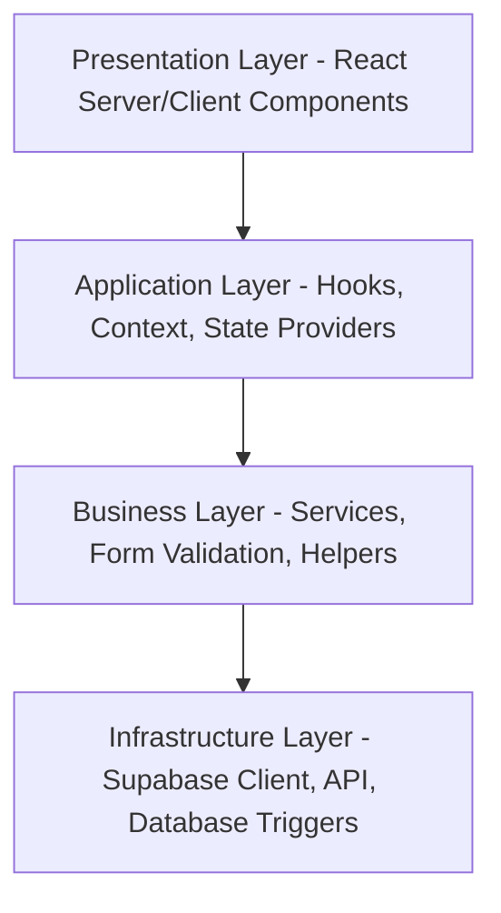

# International Student Compliance Management System (ISCMS)
## Project Constitution (Version 1.0)

This document serves as the governing constitution for the design, architecture, database structure, coding standards, security, performance, and workflow implementation of the International Student Compliance Management System (ISCMS). All engineering efforts must adhere strictly to these principles.

---

## 1. Vision

### Purpose of ISCMS
The International Student Compliance Management System (ISCMS) is a dedicated enterprise platform designed to centralize and automate compliance workflows for international students. It mitigates the operational risks associated with tracking passport validity, visa expiry dates, eFRRO (electronic Foreigners Regional Registration Office) documentation, residence permits, and fee records.

### Long-Term Objective
To establish a highly reliable, zero-tolerance platform for compliance failures that serves as the single source of truth for university registrars, compliance officers, and legal advisors. By automating critical communications and audit logs, the system eliminates administrative oversights that could lead to deportation, financial penalties, or visa revocations.

### The Business Problem Solved
Educational institutions hosting international students face strict, non-negotiable statutory timelines. Tracking compliance requirements (e.g., renewing visas within 30 days of expiry) manually via spreadsheets is prone to human error, lacks audit trails, and introduces severe legal liabilities. ISCMS resolves this by providing automated early warning indicators, secure encrypted storage for immigration documents, and an unalterable audit log of all compliance activities.

---

## 2. Project Goals

- **Zero Missed Compliance Reminders**: Automatically trigger email and WhatsApp notifications at designated thresholds (e.g., 90, 60, 30, 15, and 7 days prior to document expiration).
- **Centralized Student Records**: Consolidate passport, visa, eFRRO, fees, and enrollment details into a single digital record.
- **Complete Audit History**: Maintain a read-only, immutable history of all document modifications, approval actions, and compliance overrides.
- **Automated Compliance Tracking**: Automatically calculate compliance statuses (e.g., *Compliant*, *Warning*, *Non-Compliant*, *Grace Period*) based on live immigration dates.
- **High Reliability**: Ensure a minimum of 99.9% uptime for checking expiries and dispatching background alerts.

---

## 3. Core Principles

- **Security First**: All student personal data and uploaded immigration documents must be encrypted at rest and in transit. Row-Level Security (RLS) must be applied to every database query.
- **Documentation First**: No code implementation may begin without the corresponding specification documents (SRS, Database Schema, or API Spec) being finalized and reviewed.
- **Database First**: The database is the system of truth. Integrity constraints, cascade rules, and check constraints must reside in the database, not solely in the application layer.
- **Simplicity over Unnecessary Complexity**: Refactor code to be highly cohesive and modular. Avoid adding speculative features or unrequested abstractions.
- **Immutable Audit History**: The compliance and notification logs must be append-only. Modification or deletion of audit logs is programmatically impossible.
- **Configuration over Hardcoding**: Alert thresholds, email templates, and navigation configurations must be stored in configuration files or administrative tables rather than hardcoded in application logic.
- **Production-Ready Code Only**: Placeholders, mock data, and bypass statements (such as `any` in TypeScript or skipped validation checks) are strictly prohibited.
- **Accessibility**: Interface elements must align with WCAG 2.1 AA standards.
- **Maintainability**: Utilize standard patterns (e.g., Next.js Route Groups and feature-organized component subfolders) so that developers can trace logic quickly.
- **Scalability**: Design database structures and serverless operations to scale horizontally, avoiding locks on major transactional tables.

---

## 4. Technology Stack

- **Next.js (App Router)**: Selected to provide optimized Server-Side Rendering (SSR) for the initial layout load, combined with Client Components for dynamic form validation. App Router provides native Route Group structures to cleanly separate public, auth, and dashboard workspaces.
- **TypeScript (Strict Mode)**: Enforces type safety during compilation, preventing run-time errors and reducing cognitive load for developers tracing complex immigration schemas.
- **Tailwind CSS**: Offers utility-first styling mapped directly to CSS variables to enforce design token uniformity across themes.
- **shadcn/ui**: Provides highly accessible, unstyled primitive components built on top of Radix UI, allowing the creation of custom, premium styling without manual Radix state management.
- **Supabase**: Serves as the backend-as-a-service, wrapping authentication, real-time subscriptions, and postgrest API interactions under a single secure gateway.
- **PostgreSQL**: The core relational database. Selected for its native JSONB support, transactional integrity, advanced indexing, triggers, and Row-Level Security (RLS) policies.
- **Supabase Storage**: Provides secure, private bucket storage for sensitive immigration PDFs and images with time-limited signed URL generation.
- **Supabase Auth**: Enforces JSON Web Token (JWT) verification, email/password logins, and multi-factor authentication patterns.
- **React Hook Form**: Minimizes re-renders during form state updates and manages form state lifecycle seamlessly.
- **Zod**: Used for runtime schema validation on both client inputs and server environment configurations to prevent invalid data payloads from entering the system.
- **TanStack Table**: Manages sorting, filtering, and pagination states of large tabular compliance lists on the client side without tying logic to a specific UI style.
- **React Query**: Handles client-side API caching, optimistic updates, and automatic query re-fetching for dynamic views.
- **Resend**: Chosen as the primary transactional email delivery service due to its clean API and robust support for React Email templates.
- **WhatsApp Provider Abstraction**: A custom design abstraction layer that delegates notifications to a WhatsApp API client, ensuring that changing providers requires only replacing the low-level client configuration.

---

## 5. Architecture Principles

### Presentation Layer
- **Components**: Located in `src/components/` and `src/app/`.
- **Responsibility**: Render UI layouts, capture user actions, and present data. Primarily uses Server Components, shifting to Client Components *only* for form interaction and visual UI toggling.

### Application Layer
- **Components**: Located in `src/providers/` and `src/hooks/`.
- **Responsibility**: Manages client-side application state, theme switching context, TanStack Query caching boundaries, and UI toast triggers.

### Business Layer
- **Components**: Located in `src/services/` and `src/utils/`.
- **Responsibility**: Houses core compliance calculation logic (e.g., computing if a student is within warning periods based on visa dates), data validation rules using Zod, and formatting helper functions.

### Infrastructure Layer
- **Components**: Located in `src/lib/` and `supabase/`.
- **Responsibility**: Direct interactions with Supabase Client, cookie management on the server, third-party API handlers (Resend/WhatsApp), and raw PostgreSQL queries/migrations.

---

## 6. Database Standards

- **UUID Primary Keys**: Every table must use `UUID v4` values generated by the database as its primary key (e.g., `gen_random_uuid()`) to prevent resource enumeration.
- **snake_case Naming**: All tables, columns, schemas, indexes, and triggers must use `snake_case`.
- **No Hardcoded Values**: Use foreign key lookups or check constraints. For instance, student visa states must be validated against a pre-populated `visa_statuses` table or a strict postgres enum.
- **Versioned Documents**: Documents (such as visa uploads) must not be overwritten. Maintain a `document_history` table tracking upload timestamps, file references, and verification status.
- **Immutable History**: Log tables (such as `compliance_audit_logs` and `sent_notifications`) must only allow `INSERT` actions. `UPDATE` and `DELETE` queries must be blocked via PostgreSQL triggers or RLS policies.
- **Foreign Key Rules**: All foreign keys must have explicit integrity rules (e.g., `ON DELETE RESTRICT` or `ON DELETE CASCADE` where logically safe).
- **Indexes**: Create indexes on all foreign keys and frequently queried status columns (e.g., `visa_expiry_date`, `compliance_status`).
- **Triggers**: Automate operations like updating `updated_at` timestamps or inserting audit records using native database triggers.
- **Migration Policy**: All schema changes must be written as versioned SQL migrations under `supabase/migrations/` and verified in local development before deployment. Manual database manipulation in production is strictly prohibited.
- **Row-Level Security (RLS)**: RLS must be enabled on every table. Default policies must deny all access unless explicitly permitted by authenticated role checks (e.g., `auth.uid() = user_id`).
- **Private Storage**: All document buckets in Supabase Storage must be set to `private`. Access is granted exclusively through signed, temporary URLs.

---

## 7. Backend Standards

- **Validation**: All server-side data entry inputs must be parsed against a strict Zod schema before processing.
- **Error Handling**: Use structured try-catch blocks returning normalized error payloads. Do not expose database-level tracebacks to the client.
- **Logging**: Implement a standardized logging system (via `src/utils/logger.ts`) classifying actions into levels (`info`, `warn`, `error`). Do not log sensitive student metadata.
- **Service Architecture**: Services must be modular and separated by concern (e.g., `src/services/student.ts`, `src/services/notification.ts`).
- **Notification Architecture**: Implement a decoupled notification engine. It must insert records into a `notification_queue` table which is consumed by background edge functions, ensuring transactional speed is not affected by email or WhatsApp API latencies.
- **Business Rule Enforcement**: Critical business constraints (e.g., "A student cannot register a new visa if the current passport is expired") must be validated on the server before updating the database.
- **Database-First Development**: Define schemas, indexes, and RLS rules in SQL first. The application code must inherit these boundaries.

---

## 8. Frontend Standards

- **Reusable Components**: Interface primitives (buttons, modals, inputs) must be sourced from the `ui/` folder. Custom variations must be built by extending these primitives via composition.
- **Consistent Layouts**: Route pages must utilize standard container dimensions defined in the design system token classes.
- **Responsive Design**: UI layouts must render cleanly on laptops and tablets. Large lists must adapt to list cards on narrow mobile widths.
- **Accessibility**: Ensure keyboard operability, focus styling, and appropriate labeling (`aria-label`, screen-reader text) on all interactive forms.
- **States**:
  - **Loading States**: Display full-page loaders or skeleton containers when fetching datasets.
  - **Error States**: Display error warnings with clear messages and retry actions.
  - **Empty States**: Present placeholder messaging when lists contain no records.
- **Auto-save Strategy**: Draft form states can be periodically cached in `localStorage` or auto-saved via background debounces to prevent loss of long-form compliance data.
- **Form Validation**: Client-side validation must be executed via Zod schemas linked to `react-hook-form` to display immediate error highlights to users.

---

## 9. UI/UX Standards

- **Action-Oriented Dashboard**: The landing view must prioritize urgent tasks: upcoming document expiries, verification queues, and failed notifications.
- **Maximum Three-Click Navigation**: Ensure any record or system setting is reachable within three clicks from the main sidebar dashboard.
- **Search-First Experience**: High-density pages (like student lists) must contain persistent global filters and quick search capabilities.
- **Professional Enterprise UI**: Use a clean layout system relying on a neutral color palette, subtle borders, and consistent elevation states (shadows).
- **Consistency**: Button layout placements, header alignments, and typography heights must be identical across all views.
- **Minimal Cognitive Load**: Group related compliance inputs into tabbed sections rather than presenting single long forms.
- **Desktop-First**: Optimized for desktop interfaces (1920x1080 and 1440x900) where administrative compliance work occurs.
- **Tablet Support**: Layout sidebars must collapse gracefully to handle tablet viewports.
- **Limited Mobile Support**: Focus on read-only tracking views and critical override actions rather than complex student registrations on mobile.

---

## 10. Security Standards

- **Authentication**: Managed via Supabase Auth. Session tokens must be encrypted, stored in HttpOnly cookies, and automatically refreshed by Next.js middleware.
- **Authorization**: Role-Based Access Control (RBAC) must be enforced. Users must be categorized (e.g., *Administrator*, *Officer*, *Auditor*) with permissions verified at the API routing and database policy levels.
- **Private Storage**: Student files (passport PDFs, visa scans) must be saved under encrypted private buckets. Raw URLs must never be exposed.
- **Environment Variables**: Sensitive API keys and keys must be validated at runtime via a Zod schema (`src/utils/env.ts`). Do not expose server-side keys to client-side code blocks.
- **Server-Side Validation**: Never trust the client. Even if validated on the frontend, schemas must be re-validated on the backend.
- **Audit Logging**: Any write action must record the actor, timestamp, IP placeholder, and target identifier in the immutable database audit log.
- **Sensitive Data Handling**: Student personal identification numbers and passports must be protected behind RLS policies limiting visibility strictly to authorized personnel.

---

## 11. Performance Standards

- **Fast Page Load**: The application main viewport must load and render in under 1.5 seconds under standard network latency by using Next.js Server Components.
- **Optimized Database Queries**: All table scans must use proper indexing. Queries joining more than three transactional tables must be written as optimized database views.
- **Efficient Indexing**: Indexes must be created on foreign key columns and columns frequently filtered on (e.g., `student_id` in document tables).
- **Minimal API Requests**: Avoid duplicate API requests. Cache static lists (e.g., country codes, visa types) in TanStack Query client memory.
- **Optimized Rendering**: Avoid inline function bindings in React props to prevent redundant child component re-renders. Use React memoization (`useMemo`, `useCallback`) on complex list calculations.

---

## 12. Coding Standards

- **Strict TypeScript**: Set `strict: true` in `tsconfig.json`. Explicit typing is required on all inputs and return signatures.
- **No "any"**: The use of `any` is strictly prohibited. If a type is unknown, use `unknown` and apply a type guard.
- **No Duplicated Logic**: Abstract redundant queries, date parsing, and status calculations into dedicated utilities or custom react hooks.
- **Reusable Hooks**: Abstract repeatable client states (e.g., handling state of open menus or active routes) into hooks under `src/hooks/`.
- **Reusable Services**: Communication with the Supabase API must be written once in a service file and exported. Do not write inline DB calls in React components.
- **Consistent Folder Structure**: Group components by concern inside feature-level directories.
- **Meaningful Naming Conventions**:
  - Components: PascalCase (`StudentCard.tsx`)
  - Hook files: camelCase prefixed with use (`useStudentCompliance.ts`)
  - Utility/Services files: camelCase (`dateHelpers.ts`, `studentService.ts`)
  - Database objects: snake_case (`student_records`)

---

## 13. Git Workflow

- **Feature Branches**: All development must occur on separate branch layouts created from `main`. Naming convention: `feature/feature-name` or `bugfix/issue-name`.
- **Pull Requests**: Code changes must be submitted via a Pull Request (PR). Every PR must detail the features added, tests run, and screenshot validations of any UI changes.
- **Code Review**: At least one senior peer review approval is required before a PR can be merged.
- **Merge Policy**: Commit history must be squashed and merged to keep the master git history clean and readable.
- **No Direct Commits to Main**: Committing directly to the `main` branch is disabled at the repository level.

---

## 14. Testing Standards

- **Unit Testing**: Unit tests must be written for pure business logic functions (e.g., date calculations, status evaluation logic).
- **Integration Testing**: Test data flow between forms, context providers, and service mockups.
- **End-to-End Testing**: Use Playwright or Cypress to automate user flows like student creation and visa uploads.
- **Regression Testing**: Rerun tests on every commit via CI/CD workflows to guarantee that code updates do not break existing functionality.
- **Acceptance Testing**: Features must satisfy every criteria outlined in the user stories before sign-off.

---

## 15. Documentation Standards

The following documents must reside in the repository and be updated continuously:
- **`README.md`**: Main workspace introduction, quick setup, and command executions.
- **`docs/00_Project_Constitution.md`**: This governing constitution file.
- **`docs/SRS.md`**: Software Requirements Specification describing exact functional behavior.
- **`docs/DATABASE.md`**: Database Schema, column descriptions, and relationship maps.
- **`docs/API.md`**: Internal edge function calls and external integration patterns.
- **`docs/VISION.md`**: Product roadmap and long-term milestones.
- **`docs/PROJECT_STRUCTURE.md`**: Explanation of folder locations and architecture layers.
- **`docs/ARCHITECTURE.md`**: Security architecture, cookies, middleware, and RLS designs.
- **`docs/CODING_STANDARDS.md`**: Extended typing rules and style guide notes.
- **`docs/SECURITY.md`**: Key rotation guidelines, vulnerability disclosures, and RBAC tables.
- **`docs/CHANGELOG.md`**: Release tracking logs.

---

## 16. Definition of Done

A task is marked completed and ready for production only when:
- [ ] Functional requirements are met.
- [ ] Business rule validations are enforced on both client and server layers.
- [ ] Database constraints, foreign keys, and indexes are active.
- [ ] Row-Level Security (RLS) is validated for all database queries.
- [ ] The user interface passes responsiveness and WCAG accessibility standards.
- [ ] TypeScript checks compiler step runs with zero errors.
- [ ] ESLint checks run with zero warnings and zero errors.
- [ ] All unit, integration, and E2E tests pass.
- [ ] Architecture modifications are documented in the corresponding files.

---

## 17. Acceptance Criteria

A project phase can be approved only when:
- All features in the scope of the phase pass the **Definition of Done**.
- The code compilation (`npm run build`) succeeds cleanly without warning outputs.
- Test coverage metrics meet the predetermined thresholds.
- User acceptance testing (UAT) succeeds with zero high-severity issues.

---

## 18. Release Process

1. **Development**: Feature branch pushed and tested locally.
2. **Review**: Pull request created, peer-reviewed, and updated based on feedback.
3. **Testing**: Automated CI runs linter, tests, and builds against staging environments.
4. **Approval**: Product manager or lead engineer signs off on UAT metrics.
5. **Production**: Branch is merged to `main`, auto-triggering deployment to production (Vercel).
6. **Post-release verification**: Operational metrics, error logs, and database RLS validations are checked within the first hour of release.
