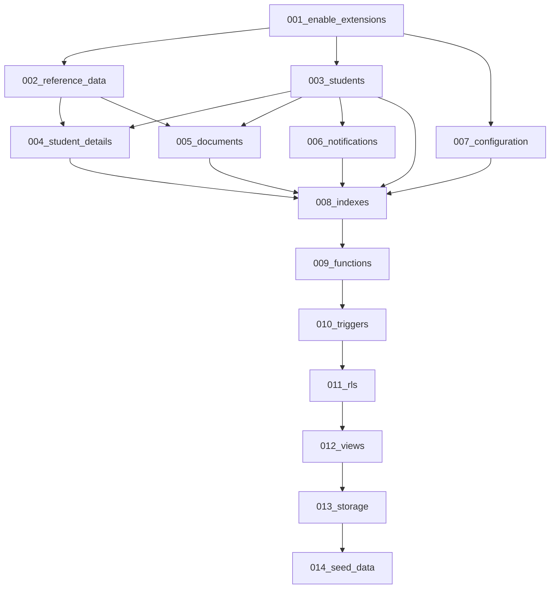

# International Student Compliance Management System (ISCMS)
## Database Implementation Plan (DIP) - Version 1.1 (Revised)

This document defines the step-by-step roadmap, dependency graphs, rollback strategies, and deployment mechanisms for implementing the approved database schema in Supabase. It ensures migrations run without constraint failures or cycle blocks.

---

## Section 1 – Implementation Philosophy

- **Incremental Execution**: Migrations are executed in sequential, isolated blocks. Running a single massive script makes debugging difficult when triggers or constraints fail. Incremental migration ensures we isolate failures to specific files.
- **Immutable Migrations**: Once a migration is applied, it must never be modified. Adjustments must be written as a new versioned migration.
- **Dependency-Driven Order**: Tables, foreign keys, and indexes must be created strictly in topological order. Parent configuration and lookup tables must exist before target transactional tables reference them.
- **Database-First Development**: Schemas, Row-Level Security (RLS) rules, validation constraints, and log triggers must exist in PostgreSQL first. The application code must inherit these boundaries.
- **Separation of Functions and Triggers**: In PostgreSQL, a trigger function must return the type `TRIGGER` and be defined in the database *before* a `CREATE TRIGGER` statement can reference it. Therefore, function definitions and trigger attachments are separated into two distinct migrations (`009_functions.sql` and `010_triggers.sql`) to prevent compilation errors and dependency mismatches.

---

## Section 2 – Migration Roadmap & Naming Standard

All migration files must reside under `supabase/migrations/` and follow the exact naming convention: `[Sequence]_[Action_Description].sql`.

### 001_enable_extensions.sql
- **Purpose**: Enable required PostgreSQL extensions.
- **Objects Created**: Enable `uuid-ossp` and `pgcrypto` extensions.
- **Dependencies**: None.
- **Transaction**: Run inside a transaction.
- **Placement**: First. Generates primary key UUIDs for all subsequent tables.

### 002_reference_data.sql
- **Purpose**: Lookup configurations for countries, fees, and statuses.
- **Objects Created**: Table `reference_data`.
- **Dependencies**: `001_enable_extensions.sql`.
- **Transaction**: Run inside a transaction.
- **Placement**: Second. Normalization lookups must exist before student files can reference ISO codes.

### 003_students.sql
- **Purpose**: Creates core student identity structure.
- **Objects Created**: Table `students`.
- **Dependencies**: `001_enable_extensions.sql`.
- **Transaction**: Run inside a transaction.
- **Placement**: Third. The primary record that all other profiles inherit.

### 004_student_details.sql
- **Purpose**: Normalized student details tables.
- **Objects Created**: Tables `student_personal`, `student_contact`, `student_academic`, `student_relationships`, `student_embassy`.
- **Dependencies**: `002_reference_data.sql`, `003_students.sql`.
- **Transaction**: Run inside a transaction.
- **Placement**: Fourth. Depends on `students` for primary keys and `reference_data` for nationality/program lookups.

### 005_documents.sql
- **Purpose**: Immigration document version control.
- **Objects Created**: Tables `passport_versions`, `visa_versions`, `efrro_versions`, `student_snapshot`.
- **Dependencies**: `002_reference_data.sql`, `003_students.sql`.
- **Transaction**: Run inside a transaction.
- **Placement**: Fifth. Depends on core students for primary keys.

### 006_notifications.sql
- **Purpose**: Background alerting queue.
- **Objects Created**: Table `notifications` and `activity_log`.
- **Dependencies**: `003_students.sql`.
- **Transaction**: Run inside a transaction.
- **Placement**: Sixth. Queues require referencing existing student IDs.

### 007_configuration.sql
- **Purpose**: Institutional settings and holiday calendar definitions.
- **Objects Created**: Tables `system_settings`, `holiday_calendar`.
- **Dependencies**: `001_enable_extensions.sql`.
- **Transaction**: Run inside a transaction.
- **Placement**: Seventh. Basic configurations used for subsequent reminder scheduling.

### 008_indexes.sql
- **Purpose**: B-Tree and partial performance indexing.
- **Objects Created**: Index mappings for expiries, queues, and soft deletes.
- **Dependencies**: `003_students.sql` through `007_configuration.sql`.
- **Transaction**: Run inside a transaction.
- **Placement**: Eighth. Applied after all tables exist.

### 009_functions.sql
- **Purpose**: Defines all trigger functions.
- **Objects Created**: SQL functions: `fn_set_updated_at()`, `fn_log_activity()`, `fn_compile_compliance_snapshot()`, `fn_cancel_notifications()`.
- **Dependencies**: `003_students.sql` through `007_configuration.sql`.
- **Transaction**: Run inside a transaction.
- **Placement**: Ninth. Functions must be compiled and defined in the database before they can be attached to tables in the next step.

### 010_triggers.sql
- **Purpose**: Binds trigger functions to specific table events.
- **Objects Created**: Triggers: `tr_students_updated_at`, `tr_student_audit`, `tr_passport_version_inserted`, etc.
- **Dependencies**: `009_functions.sql`.
- **Transaction**: Run inside a transaction.
- **Placement**: Tenth. Trigger function definitions are referenced by name during attachment.

### 011_rls.sql
- **Purpose**: Role-Based Access Control filters.
- **Objects Created**: RLS policy settings.
- **Dependencies**: `003_students.sql` through `007_configuration.sql`.
- **Transaction**: Run inside a transaction.
- **Placement**: Eleventh. Protects all tables before views or seed files are loaded.

### 012_views.sql
- **Purpose**: Create read-only database views that simplify application-side queries.
- **Objects Created**: Views: `vw_student_directory`, `vw_dashboard_summary`, `vw_expiring_documents`, `vw_notification_queue`.
- **Dependencies**: `003_students.sql` through `006_notifications.sql`.
- **Transaction**: Run inside a transaction.
- **Placement**: Twelfth. Applied after all schemas, indexes, and RLS rules are active.

### 013_storage.sql
- **Purpose**: Secure document folders.
- **Objects Created**: Private bucket `student-documents` and Radix folder access policies.
- **Dependencies**: `011_rls.sql`.
- **Transaction**: Run inside a transaction. (Storage creation uses Supabase client APIs, but policies run inside standard SQL transactions).
- **Placement**: Thirteenth. Enables secure folder structures.

### 014_seed_data.sql
- **Purpose**: Populate lookups and initial variables.
- **Objects Created**: ISO codes, initial settings variables, and holidays calendar rows.
- **Dependencies**: `002_reference_data.sql`, `006_notifications.sql`, `007_configuration.sql`.
- **Transaction**: Run inside a transaction.
- **Placement**: Last. Inserts metadata.

---

## Section 3 – Dependency Graph

---

## Section 4 – Validation Strategy

To prevent data corruption, validation responsibilities are cleanly decoupled between the database layer and the application layer.

### Database Layer
- **NOT NULL Constraints**: Enforces that mandatory fields (e.g. `registration_number`, `expiry_date`) are never omitted.
- **Foreign Keys**: Guarantees referential integrity. Student detail records cannot point to non-existent student IDs.
- **UNIQUE Constraints**: Enforces uniqueness (e.g., student email, registration number) at the system level.
- **CHECK Constraints**: Restricts column values to allowed business parameters (e.g. `expiry_date > issue_date`, `current_semester > 0 AND current_semester < 20`, enum-like checks on status columns).
- *Rationale*: Database constraints are the final, absolute boundary. They run closer to the data engine, preventing corrupted data from entering the database through external SQL injections or API bugs.

### Application Layer
- **Zod Schema Parsing**: Client forms and API routes validate payload shapes, regex patterns, and string lengths before database calls.
- **Interactive UI Validation**: Highlights errors immediately (e.g., matching email regex, verifying input lengths) without waiting for database responses.
- *Rationale*: Frontend and edge validation optimize UX by showing instantaneous alerts, reducing database load, and sanitizing inputs before they reach database layers.

---

## Section 5 – Transaction Strategy

- **Default Transaction Usage**: Every migration file (from `001` to `014`) runs within a database transaction block (`BEGIN` ... `COMMIT`).
- **Failure Recovery Approach**: If any query within a migration script fails, the database rollback engine cancels all statements in that script. This prevents "partial migrations" (where some tables compile but others fail), leaving the database schema clean and predictable.
- **Storage Policy Transactions**: Supabase Storage bucket creations can be performed outside transactions via the dashboard or CLI, but policy configurations (`INSERT/SELECT` policies on `storage.objects`) must run inside standard SQL transaction scripts.

---

## Section 6 – Read-Only Database Views (012_views.sql)

To simplify frontend querying and avoid repetitive database joins, a series of read-only views are created. These views act as simple read filters and do not execute business logic:

1. **`vw_student_directory`**
   - **Purpose**: Consolidate student details (personal, contact, and academic) under a single record to simplify student list rendering.
   - **Usage**: Queried by the main student search index.
2. **`vw_dashboard_summary`**
   - **Purpose**: Return count aggregates of students grouped by their cached compliance status (`compliant`, `warning`, `non_compliant`).
   - **Usage**: Used to drive main dashboard status widgets.
3. **`vw_expiring_documents`**
   - **Purpose**: Lists all active passports, visas, and eFRRO certificates that are expiring within the next 90 days.
   - **Usage**: Powers dashboard urgency queues and verification triggers.
4. **`vw_notification_queue`**
   - **Purpose**: Returns queued warnings (`status = 'queued'`) joined with the student's registration number and email address.
   - **Usage**: Queried by the background Edge functions to pull pending notifications.

---

## Section 7 – Trigger Testing Matrix

All trigger operations mapped in `010_triggers.sql` must satisfy the following validation criteria:

| Trigger Name | Event | Expected Behaviour | Verification Method |
| :--- | :--- | :--- | :--- |
| `tr_set_updated_at` | `BEFORE UPDATE` | Resets `updated_at = now()`. | Perform an `UPDATE` on a row and verify that `updated_at` changed. |
| `tr_student_audit` | `AFTER INSERT/UPDATE/DELETE` | Inserts data diff to `activity_log` with Supabase `auth.uid()`. | Run a write query and verify that a matching record is created in `activity_log`. |
| `tr_compile_snapshot` | `AFTER INSERT/UPDATE/DELETE` on versions | Re-calculates and caches expiry timelines in `student_snapshot`. | Insert a new verified visa version and verify that `student_snapshot.days_to_visa_expiry` changes. |
| `tr_auto_cancel_alerts`| `AFTER UPDATE` on documents | Set queued notifications for the document category to `cancelled`. | Change document status to `verified` and confirm that matching `notifications` rows switch to `cancelled`. |

---

## Section 8 – Seed Data Classification

Seed data is split into two categories to prevent configuration drift:

### Static Seed Data (Migrations)
- **Examples**: ISO country codes, fee types (`tuition`, `exam`), document statuses (`pending`, `verified`, `rejected`), visa types (`student`, `tourist`).
- **Policy**: Injected directly during `014_seed_data.sql`. These are system constants.

### Configurable Seed Data (Database / Application)
- **Examples**: Academic courses list, schools, holiday calendars.
- **Policy**: Populated with minimal base defaults during migration. However, any subsequent changes must be made via the administrative dashboard and saved directly to the database.

---

## Section 9 – Performance Verification

Following the execution of all migrations, the database administrator must perform the following validation checks:

- **Index Verification**: Run `SELECT * FROM pg_indexes WHERE schemaname = 'public';` to confirm that all unique constraints and index columns are compiled.
- **Query Plan Verification**: Run `EXPLAIN ANALYZE` on core dashboard queries to verify they are using index scans instead of sequential table scans.
- **Sequential Scan Detection**: Verify that dashboard lookups querying `student_snapshot` return index scans, maintaining O(1) read latency.
- **Constraint Performance**: Insert 1,000 mock student profiles and verify that academic date validations do not introduce transactional blockages.

---

## Section 10 – Deployment & Rollback Strategy

### Rollback Strategy
- **DROP Scripts**: Every migration file must have a corresponding rollback file under `supabase/migrations/rollback/` matching the naming convention `[Sequence]_rollback_[Action_Description].sql`.
- **Execution Order**: Rollbacks must run in the exact reverse sequence order of migrations (e.g. `014_seed_data_rollback` down to `001_enable_extensions_rollback`) to prevent constraint violations.
- **Production Safety**: Rollback scripts must never be run on production databases. Production databases must be restored from pre-deployment backups.

### Deployment Stages
1. **Local Dev**: Apply migrations using the Supabase CLI: `supabase db push`.
2. **Preview Staging**: GitHub Actions spins up a preview environment, applies the migrations, runs the tests, and shuts down.
3. **Production Deployment**: Deploy migrations during scheduled maintenance windows. Perform database backups immediately before deploying.
