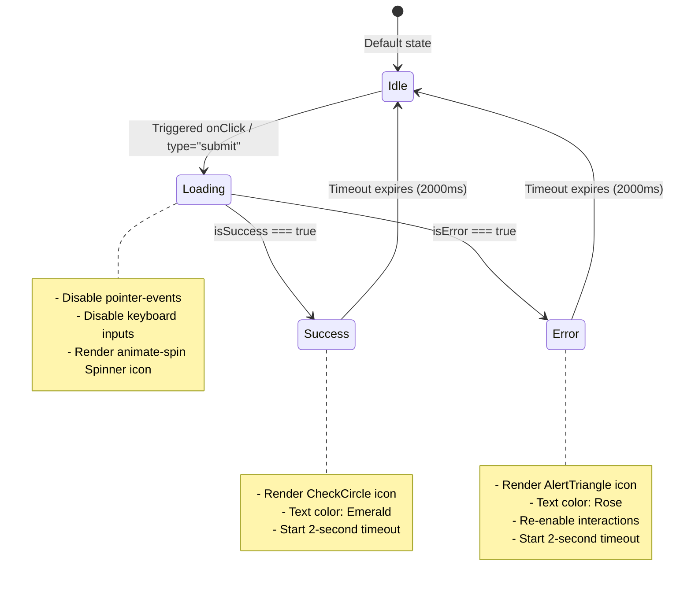

# Centralized AsyncActionButton System Walkthrough

This document outlines the design and integration of the platform-wide `AsyncActionButton` component in the International Student Compliance Management System (ISCMS).

---

## 1. Component Specification (`async-action-button.tsx`)

The reusable component is located at [async-action-button.tsx](file:///d:/Saarth/Saarth/International%20Student%20Compliance%20Management%20System/src/components/ui/async-action-button.tsx). It standardizes all asynchronous submissions (saves, deletes, triggers, uploads, exports, verification approval, login, and logout actions) across the platform.

### API Properties (Props)
*   `idleText: React.ReactNode` — Label displayed under default state (e.g., "Save Changes").
*   `loadingText: React.ReactNode` — Label displayed when operation is ongoing (e.g., "Saving changes...").
*   `successText: React.ReactNode` — Label displayed upon successful operation (e.g., "Changes saved").
*   `errorText: React.ReactNode` — Label displayed upon operation failure (e.g., "Try Again").
*   `isLoading: boolean` — External flag mapping if operation is pending.
*   `isSuccess: boolean` — External flag mapping if operation succeeded.
*   `isError: boolean` — External flag mapping if operation threw error.
*   `className?: string` — Standard layout styling overrides.
*   `variant?: ButtonVariant` — Shadcn UI button variants (`default`, `outline`, `secondary`, `ghost`, `destructive`, `link`).
*   `size?: ButtonSize` — Shadcn UI button size classes (`default`, `sm`, `lg`, `icon`).
*   `type?: "button" | "submit" | "reset"` — Standard HTML button behavior.
*   `onClick?: (e: React.MouseEvent) => void` — Mouse action trigger handler.

---

## 2. Visual States & Transition Diagram

The component operates as a self-reverting state machine that syncs with external flags and transitions internally.

---

## 3. Accessibility & Submission Safety

The button implements strict safety and accessibility standards:
*   `aria-busy="true"` and `aria-live="polite"` are assigned dynamically during operations.
*   `aria-disabled="true"` is assigned during non-idle states to maintain focus viability.
*   `pointer-events-none` styling overrides block click events at the browser engine rendering layer, eliminating double submission hazards.

---

## 4. Replaced Action Buttons List

The `AsyncActionButton` has replaced all standard buttons in the following execution points:

1.  **Staff Profile**: [profile/page.tsx](file:///d:/Saarth/Saarth/International%20Student%20Compliance%20Management%20System/src/app/(app)/profile/page.tsx)
2.  **Central System Settings**: [settings/page.tsx](file:///d:/Saarth/Saarth/International%20Student%20Compliance%20Management%20System/src/app/(app)/settings/page.tsx)
    *   General Configurations save
    *   Alert channels configuration toggle
    *   Staff Password Update save
    *   Global logout action button
3.  **Student Registration**: [add/page.tsx](file:///d:/Saarth/Saarth/International%20Student%20Compliance%20Management%20System/src/app/(app)/students/add/page.tsx)
4.  **Student Details Edit**: [[id]/page.tsx](file:///d:/Saarth/Saarth/International%20Student%20Compliance%20Management%20System/src/app/(app)/students/[id]/page.tsx)
    *   Edit Profile details modal submit button
    *   Manual dispatch Warning Alert trigger button
5.  **Student Portal Document Upload**: [efrro/page.tsx](file:///d:/Saarth/Saarth/International%20Student%20Compliance%20Management%20System/src/app/student/efrro/page.tsx)
6.  **Staff authentication login**: [login/page.tsx](file:///d:/Saarth/Saarth/International%20Student%20Compliance%20Management%20System/src/app/login/page.tsx)
7.  **Student passwordless portal login**: [login/page.tsx](file:///d:/Saarth/Saarth/International%20Student%20Compliance%20Management%20System/src/app/student/login/page.tsx)
8.  **Account Menu Sign Out**: [account-menu.tsx](file:///d:/Saarth/Saarth/International%20Student%20Compliance%20Management%20System/src/components/header/account-menu.tsx)
9.  **Document Verification Audit Actions**: [document-dialogs.tsx](file:///d:/Saarth/Saarth/International%20Student%20Compliance%20Management%20System/src/features/compliance/components/document-dialogs.tsx)
    *   Upload Document version submit button
    *   Audit Verification Rejection button
    *   Audit Verification Approval button
10. **Reports Export Generation**: [page.tsx](file:///d:/Saarth/Saarth/International%20Student%20Compliance%20Management%20System/src/app/(app)/reports/students/page.tsx)
    *   CSV data download trigger
    *   Excel data download trigger
11. **Reminder Rules Settings**: [reminder-settings.tsx](file:///d:/Saarth/Saarth/International%20Student%20Compliance%20Management%20System/src/features/notifications/components/reminder-settings.tsx)
12. **Notification Templates Manager**: [template-manager.tsx](file:///d:/Saarth/Saarth/International%20Student%20Compliance%20Management%20System/src/features/notifications/components/template-manager.tsx)
