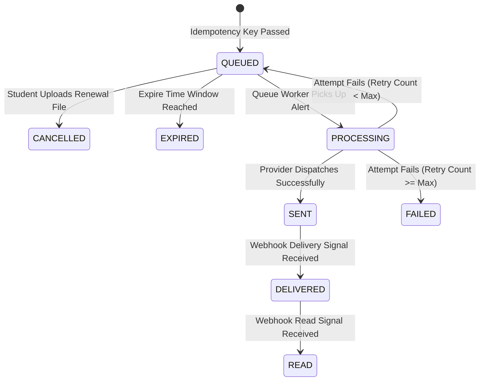

# Notification State Diagram

- **Status**: Production-Ready / Final Revision
- **Role**: Lead Software Architect
- **Sprint**: Sprint 7 - Enterprise Notification Infrastructure
- **Target Institution**: National Forensic Science University (NFSU)

---

## 1. State Transition Diagram

