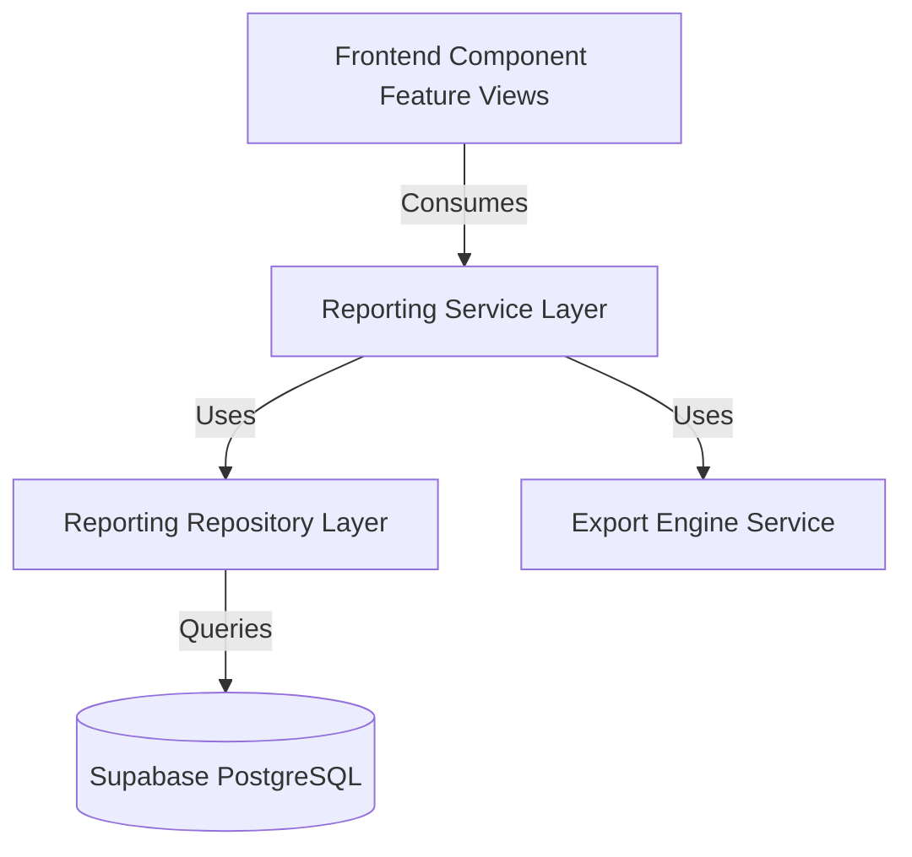

# Sprint 05 - Reporting & Analytics Architecture Specification (V2)

- **Status**: Revised & Proposed
- **Role**: Lead Software Architect
- **Sprint**: Sprint 5 - Reporting & Analytics
- **Revision Note**: Conforms to the refined business rules (Automated reminders apply ONLY to `efrro` documents; Passport and Visa remain compliance-only documents with no notifications).

---

## 1. System Architecture

The Reporting & Analytics module will follow the established clean architecture boundaries:

### A. Domain Layer (`src/domain/reports/`)
Defines canonical models for report generation:
*   `ReportMetadata`: Standard parameters like UUID, title, author, configuration variables, and creation logs.
*   `StudentReportItem`: Extends `StudentSnapshot` with nationality, course, school, and active warning flags.
*   `ComplianceMetrics`: Computed indicators including success rates, average resolution times, and trend metrics.

### B. Repository Layer (`INotificationRepository` / `IReportRepository`)
Encapsulates database access. Leverages optimized PostgreSQL queries to handle 50,000+ student records:
*   `getComplianceMetrics(): Promise<ComplianceMetrics>`
*   `queryStudentReport(filters: ReportFilters, pagination: PaginationParams): Promise<PaginatedResult<StudentReportItem>>`

### C. Service Layer (`ReportingService`)
Calculates analytics and implements search/filtering strategies:
*   `generateSummaryDashboard(): Promise<DashboardSummary>`
*   `getReportStream(filters: ReportFilters): ReadableStream` (For handling high-volume queries)

### D. Export Layer (`ExportEngine`)
Translates domain models into target formats:
*   `IExporter`: Interface containing the `export(data: unknown[], config: ExportConfig): Promise<Buffer>` method.
*   `CsvExporter`, `ExcelExporter` (using `exceljs` library), `PdfExporter` (using serverless streams).

---

## 2. Analytics & Statistics Calculation Engine

### A. Compliance Percentage
Calculated on demand or cached in the `student_snapshot` materialized view:
$$\text{Compliance } \% = \left( \frac{\text{Students with Passport, Visa, and eFRRO verified}}{\text{Total registered international students}} \right) \times 100$$

### B. Average Compliance Time
Measures the duration from initial student registration to full document verification:
$$\text{Average Time} = \frac{\sum (\text{Verification Timestamp} - \text{Registration Timestamp})}{\text{Total Verified Students}}$$

### C. Expiry Trends & Reminder Rules (eFRRO Only)
*   **eFRRO Alert Pipeline**: Evaluates upcoming expirations ONLY for `document_type = 'efrro'`. Automated reminders, notification queue entries, and retry schedulers operate exclusively on eFRRO dates.
*   **Passport and Visa**: Logged on the administrator dashboard, compliance tables, and analytics reports. Expirations display warnings, but do not trigger automated reminders or enter the notification delivery queue.
