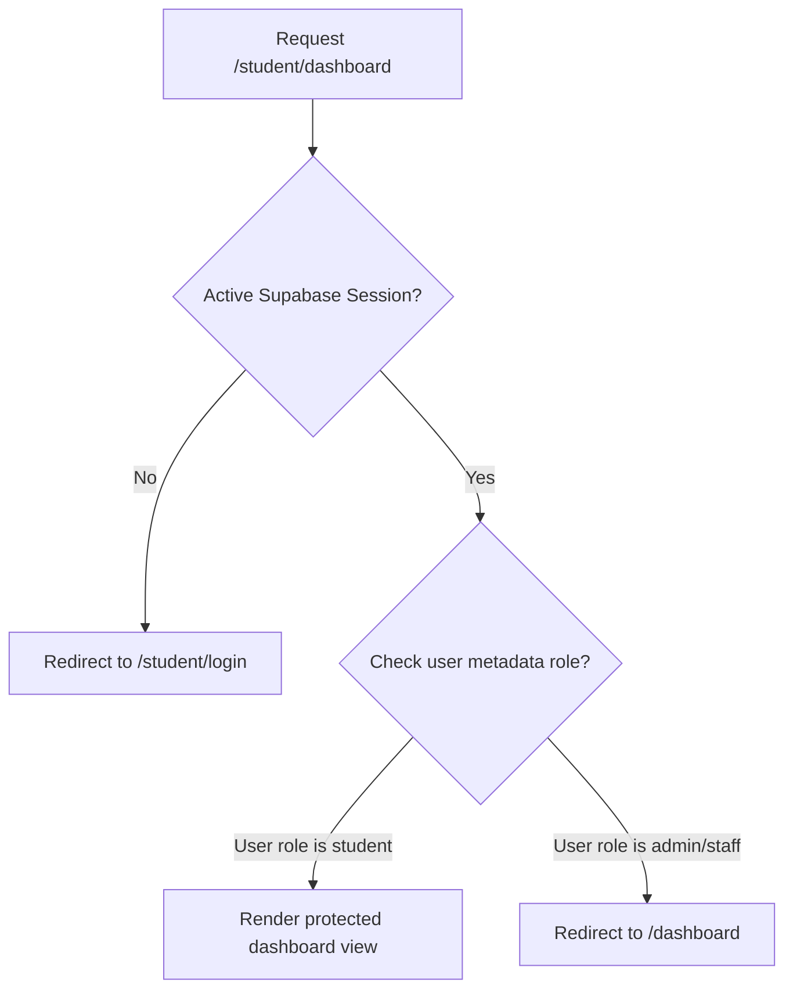

# Sprint 06 - Student Portal Route Map

- **Status**: Production-Ready / Final Revision
- **Role**: Lead Software Architect
- **Sprint**: Sprint 6 - Student Portal Foundation
- **Target Institution**: National Forensic Science University (NFSU)

---

## 1. Directory Route Mappings

The Student Portal maps endpoints under the `/student/` route path:

| URL Path | Type | Segment | Description / Protection Guard |
| :--- | :--- | :--- | :--- |
| `/student/login` | Page | Static | Landing portal for student email authentication via OTP. |
| `/student/upload/[token]` | Page | Dynamic | Landing endpoint from reminder email links. Verifies secure token and signs student in before redirecting. |
| `/student/dashboard` | Page | Static | Protected. Student welcome panel, status counters, and alerts logs. |
| `/student/profile` | Page | Static | Protected. Read-only records alongside editable contact fields. |
| `/student/history` | Page | Static | Protected. Registry grid detailing eFRRO history and comments. |
| `/student/efrro` | Page | Static | Protected. Upload interface featuring interactive file drag-and-drop. |

---

## 2. Protected Guards Flow

All routes starting with `/student/` (except `/student/login` and `/student/upload/[token]`) run protection checks within the central layout wrapper `src/app/student/layout.tsx`:

