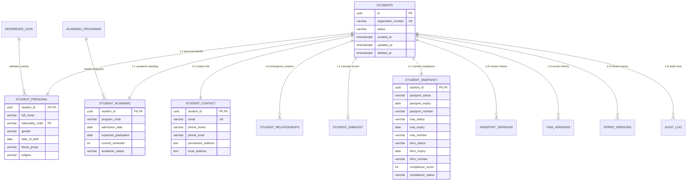

# ISCMS Production Database Integration & Relational Architecture

**System**: International Student Compliance Management System (ISCMS)  
**Classification**: Enterprise Compliance & Relational Data Architecture  
**Primary Database Engine**: PostgreSQL (Hosted on Supabase)  
**Object Storage Service**: Cloudflare R2 / S3-Compatible Object Store  
**Date**: August 2026  

---

## 1. Executive Summary & Architectural Separation

ISCMS enforces a strict separation of concerns between relational application data and binary document storage:

1. **Relational Database (Supabase PostgreSQL)**:
   - Serves as the single source of truth for all structured entities, including users, staff, students, personal demographics, contact information, academic records, emergency contacts, embassy details, document version metadata, cached compliance snapshots, audit trails, and system configuration.
   - Operates with strict Row Level Security (RLS) policies enforcing role-based permissions (Administrator, Staff Read-Write, Staff Read-Only, Student Self-Service).
   - Utilizes Supabase Realtime (logical replication publications) to broadcast table mutation events across client and staff interfaces.

2. **Object Storage (Cloudflare R2)**:
   - Dedicated exclusively to encrypted binary payloads (e.g., student passport scans, visa PDF documents, eFRRO certificates).
   - Relational database tables store only the file key/path, content length, MIME type, and cryptographic hash, never storing raw binary blobs inside SQL rows.

---

## 2. PostgreSQL Relational Entity Schema

---

## 3. Row Level Security & Authorization Matrix

| Table | SELECT | INSERT | UPDATE | DELETE |
| :--- | :--- | :--- | :--- | :--- |
| `public.students` | Staff (RO/RW), Student (Self) | Staff (RW), Admin | Staff (RW), Student (Self limited) | Admin Only |
| `public.student_personal` | Staff (RO/RW), Student (Self) | Staff (RW), Admin | Staff (RW), Student (Self) | Admin Only |
| `public.student_contact` | Staff (RO/RW), Student (Self) | Staff (RW), Admin | Staff (RW), Student (Self) | Admin Only |
| `public.student_academic` | Staff (RO/RW), Student (Self) | Staff (RW), Admin | Staff (RW), Admin | Admin Only |
| `public.student_snapshot` | Staff (RO/RW), Student (Self) | Staff (RW), Service Role | Staff (RW), Service Role | Admin Only |
| `public.passport_versions` | Staff (RO/RW), Student (Self) | Staff (RW), Student (Self) | Staff (RW) | Admin Only |
| `public.visa_versions` | Staff (RO/RW), Student (Self) | Staff (RW), Student (Self) | Staff (RW) | Admin Only |
| `public.efrro_versions` | Staff (RO/RW), Student (Self) | Staff (RW), Student (Self) | Staff (RW) | Admin Only |
| `public.audit_log` | Staff (RO/RW), Admin | Authenticated Users | None (Append-only) | Admin Only |

---

## 4. End-to-End Student Creation Lifecycle

1. **Client Submission (`/students/add`)**:
   - Form fields validated client-side against Zod v4 schemas (`RegisterStudentValidationSchema`).
   - Dispatches `registerStudentAction(payload)` Server Action over HTTPS.

2. **Server-Side Authentication & Authorization**:
   - `getServerSupabase()` verifies user session cookies via `@supabase/ssr`.
   - Rejects unauthenticated or unauthorized users before executing backend logic.

3. **Domain Validation & Duplicate Check**:
   - `StudentService.registerStudent()` re-validates payload on the server.
   - `SupabaseStudentRepository` checks for duplicate `registration_number` and `email`.

4. **Multi-Table Relational Persistence**:
   - Inserts row into `public.students` generating immutable UUID.
   - Inserts child records into `student_personal`, `student_contact`, `student_academic`, `student_relationships`, and `student_embassy`.
   - Inserts initial `passport_versions` and `visa_versions` if document identifiers are provided.
   - Computes initial compliance status and populates `student_snapshot`.
   - Emits immutable security log into `public.audit_log`.

5. **Cache Invalidation & Realtime Broadcast**:
   - `revalidatePath("/students")` and `revalidatePath("/dashboard")` purge Next.js server caches.
   - Supabase PostgreSQL CDC broadcasts realtime event on channel `iscms_global_realtime_sync`.
   - Directory page and dashboard UI components update live.

---

## 5. Security & Error Handling Guarantees

- **No Secrets in Client Bundles**: `SUPABASE_SERVICE_ROLE_KEY` is restricted strictly to server-only modules (`import "server-only"` in `src/lib/supabase/admin.ts`).
- **Sanitized Client Messages**: The `sanitizeError()` service converts raw database exceptions, foreign key violations, and network drops into clear English messages without exposing internal SQL queries, table schemas, or credentials.
- **Zero Mock / Zero LocalStorage**: All student records, directories, and profiles are read and written strictly against PostgreSQL.
